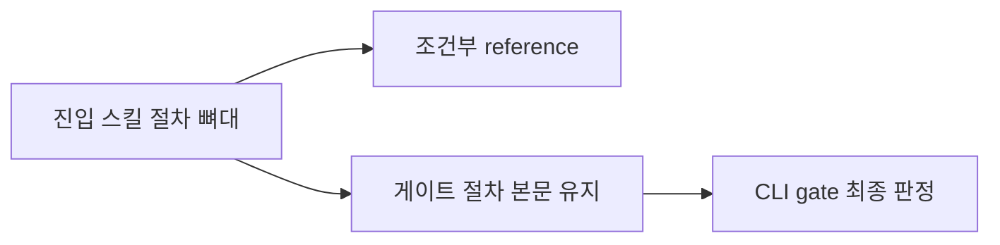

# 006 conditional-reference-split

Epic: [043](../../index.md)

## Intent
- 문제: `bouncer-finalize`(2,740단어) 한 파일에 Distill 승격, explain과 quiz, remainder commit, PR, worktree 정리, 다음 blueprint 전환이 모두 들어 있다. PR을 만들 수 없거나 승격 후보가 없는 실행에서도 그 세부 규칙 전체를 먼저 읽는다. `bouncer-plan`(2,538단어)과 `bouncer-execute`(1,907단어)도 마찬가지다.
- 완료 조건: 조건부 상세가 로딩 조건이 붙은 `references/*.md`로 내려가고, 게이트 판정·commit scope·증적 기록에 직결되는 절차는 본문에 그대로 남는다.

## Contract
- 인터페이스: 진입 `SKILL.md`에는 워크플로 순서, 각 단계의 진입 조건, 단계별 입출력, 중단 조건, ACQ 위치, reference 라우팅, 그리고 게이트 절차만 남는다. 새 `references/*.md`는 첫 문단에 그 파일을 읽는 조건을 한 문장으로 적고, 호출 단계도 같은 조건을 명시한다.
- 데이터·상태: 문서 재배치만 한다. 게이트 코드(G1–G18), `bouncer` CLI 인자, `.bouncer/` 산출물 형태는 그대로다.
- 수용 기준: epic 054 성공 조건 3·4를 충족한다. 네 진입 스킬의 조건부 상세는 대응 reference에서만 검증되고, 게이트·commit scope·증적 기록 계약은 각 `SKILL.md`에서 계속 검증된다.
- 검증 명령: `npm run ci`
- 실패 모드·엣지 케이스:
  - reference의 실패 모드는 성능 저하가 아니라 규칙 소실이다. 에이전트가 파일을 읽지 않고 지나가면 규칙이 조용히 사라진다. 게이트 절차는 성능 손해를 감수하고 본문에 남긴다.
  - `finalize`의 remainder commit은 커밋 게이트 판정에 직결되므로 본문에 남긴다. 분리 대상은 Distill 승격, explain과 quiz, PR 초안, 정리와 인계다.
  - `plan`은 승인과 plan 게이트를, `execute`는 pointer·worktree와 execute 게이트를, `run`은 루프 소유권과 task 경계 ACQ를 본문에 남긴다.
  - 파일만 쪼개면 전체 경로 실행에서 모든 reference를 다시 읽어 효과가 없다. 함께 쓰이는 규칙은 한 단계 reference에 모은다.
  - `rules/skill-shape.md`가 `assets/`와 `references/`의 구분과 워크플로 스킬의 번호 절차·마지막 ACQ 절을 요구한다. 그 형태를 유지한다.

## Out of scope
- 각 워크플로가 하는 일과 단계 순서의 변경.
- `CLAUDE.md` hard rule과 게이트 계약 문구.
- 역할별 rubric — blueprint 002가 이미 옮겼다.
- 반복 블록의 공통화 — blueprint 004 소관이다.

## One-commit justification
- 진입 스킬 하나가 그 스킬의 `SKILL.md`, 새 `references/*.md`, 직접 계약 테스트와 공통 회귀 테스트 묶음으로 완결된다. 네 스킬을 각각 task로 두면 커밋마다 한 워크플로의 분리가 끝나고, blueprint 전체가 "조건부 분리" 하나의 PR 단위다.

## Documents
* [Tasks 001](tasks/001/tasks.md) - finalize 조건부 절차 분리
* [Verification 001](tasks/001/verification.md) - 검증 명령과 증적
* [Review 001](tasks/001/review.md) - 리뷰 발견사항
* [Tasks 002](tasks/002/tasks.md) - plan 조건부 절차 분리
* [Verification 002](tasks/002/verification.md) - 검증 명령과 증적
* [Review 002](tasks/002/review.md) - 리뷰 발견사항
* [Tasks 003](tasks/003/tasks.md) - execute 조건부 절차 분리
* [Verification 003](tasks/003/verification.md) - 검증 명령과 증적
* [Review 003](tasks/003/review.md) - 리뷰 발견사항
* [Tasks 004](tasks/004/tasks.md) - run 중단·복구 절차 분리
* [Verification 004](tasks/004/verification.md) - 검증 명령과 증적
* [Review 004](tasks/004/review.md) - 리뷰 발견사항
* [Tasks 005](tasks/005/tasks.md) - 테스트 코드 줄 길이 제한 예외
* [Verification 005](tasks/005/verification.md) - 검증 명령과 증적
* [Review 005](tasks/005/review.md) - 리뷰 발견사항
* [Context review](context-review.md) - 계획 문서 정합성 판정
