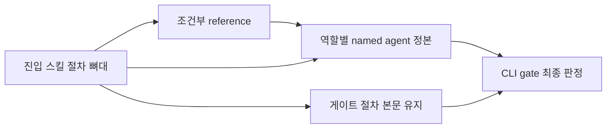

# 054 스킬 지시문 컨텍스트 최적화

## Intent
- 문제: 비용이 큰 쪽은 초기 스킬 목록(description 합계 6,090자)이 아니라 진입 스킬 하나가 실행 중에 보조 스킬과 마스터 규칙을 연쇄로 읽는 구간이다. `/bouncer-plan`은 최악 11,007단어, `/bouncer-finalize` 9,004단어, `/bouncer-execute` 8,031단어를 읽을 수 있다. 게다가 네 역할(구현·리뷰·디버깅·컨텍스트 리뷰)은 같은 절차와 guardrail을 보조 스킬과 named agent 문서에 두 벌로 들고 있어서, named agent가 실제 작업을 하는 정상 경로에서도 컨트롤러가 상세 rubric을 먼저 읽는다.
- 목표: 역할별 rubric 정본을 `agents/*.md` 하나로 모으고, 진입 스킬에는 절차 뼈대와 게이트 절차만 남기며, 조건부 상세는 그 단계에 도달했을 때만 읽는 `references/`로 내린다. 줄어드는 것은 지시문 주입량이지 게이트 계약이 아니다.

## Success criteria
1. `implementation` / `review` / `debugging` / `context-review` 네 역할에서 절차·guardrail·출력 계약 문장이 `agents/*.md` 한 곳에만 있다. 판정 절차: 네 `skills/*/SKILL.md` 본문을 항목 단위로 읽어 (a) 어떤 agent를 부르는가, (b) 넘길 task brief 절, (c) 결과에서 읽을 필드, (d) 재호출 상한, (e) fallback 조건, (f) status·gate 소유권 — 이 여섯 항목과 blueprint 002가 명시한 고유 정본 절(implementation의 주석 루브릭, context-review의 full-plan 게이트) 밖의 문장이 0건임을 확인하고, 정적 지표 3번의 `wc -w`가 네 스킬 모두에서 변경 전보다 줄었음을 확인한다.
2. named agent가 없을 때의 인라인 fallback 경로가 네 역할 모두에서 살아 있고, 그 경로에서만 같은 agent 계약을 읽도록 지시된다.
3. `skills/bouncer-{plan,execute,finalize,run}/SKILL.md`에서 게이트 절차가 `references/`로 옮겨진 것이 0건이다. 판정 절차: 각 blueprint의 diff에서 본문 → `references/`로 이동한 블록을 모두 열거하고, 블록마다 `bouncer validate --gate` / `bouncer current` / commit scope / verification·evidence 파일 경로를 지시하는 문장이 있는지 본다. 하나라도 있으면 그 블록은 본문으로 되돌린다.
4. 새로 만든 `references/*.md`마다 첫 문단에 그 파일을 읽는 조건이 한 문장으로 적혀 있고, 진입 `SKILL.md`의 해당 단계가 같은 조건으로 그 파일을 가리킨다.
5. `BOUNCER_ROOT` 해석, ACQ 옵션 순서와 출력 형식, `bouncer current` 처리, named agent model 해석과 `inherit` fallback은 `rules/` 아래 각각 한 파일에만 정본으로 있다. 데이터·지시 trust boundary는 Out of scope에 따라 `CLAUDE.md` hard rule 11을 정본으로 유지하며, 진입 스킬에는 다섯 블록의 적용 지점과 예외만 남는다.
6. `skills/*/SKILL.md`의 `description` 총합이 3,000자 이하이고 개별 description이 180자 이하다.
7. 0단계 baseline과 최종 회차가 같은 7개 회귀 시나리오·같은 기록 값으로 `docs/benchmark/history.md`에 남고, 최종 회차의 gate 통과율·review finding 수·scope 위반 수가 baseline보다 나빠지지 않는다.
8. 각 task의 `npm run ci`가 통과한다.

## Out of scope
- **보조 스킬의 비공개 전환.** `discovery`·`spec-authoring`·`implementation` 등을 진입 스킬의 `references/`로 흡수하면 초기 목록에서 이름과 description이 빠지지만, `CLAUDE.md`의 「When to invoke」 표와 각 description의 `unless the user explicitly asks for this skill by name` 문구가 그 호출 경로를 계약으로 선언해 두었다. 성능 최적화가 아니라 제품 인터페이스 변경이므로 1~4단계 측정 뒤에 따로 결정한다.
- **`allow_implicit_invocation`.** 이 저장소에 `agents/openai.yaml`도 그 키도 없다. Codex named agent 시드는 `.codex/agents/*.toml`이다. 검증되지 않은 설정을 도입하지 않는다.
- **`CLAUDE.md` hard rule과 게이트 계약 문구의 축약.** 정본 위치를 유지하고 참조 경로만 정리한다.
- **포인터·브리프·Distill 프리플라이트 주입 경로.** epic 047 `context-injection`이 그 축을 이미 다뤘고 `bouncer.scale`을 포인터에 싣는 계약을 만들었다. 이 epic은 지시문 표면만 만진다.
- **`rules/skill-shape.md`가 정한 본문 절 이름과 순서.** epic 045가 규칙과 계약 테스트로 못박은 계약이다. reference를 새로 만들되 진입 스킬 본문의 필수 절 순서는 그대로 지킨다.
- **스킬 절차의 지시 내용 변경.** 어떤 스킬이 무엇을 하는지는 바꾸지 않는다. 문장이 어디에 놓이고 언제 읽히는지만 바꾼다.
- **`agentic-code-benchmark`의 루브릭·점수 계산·arm 정의.** 0단계는 기존 하네스로 재는 일이지 하네스를 다시 설계하는 일이 아니다.

## Blueprints
우선순위 순이다. 앞 blueprint의 산출물이 뒤의 입력이므로 이 순서로 진행한다. 다만 006은 사람이 돌린 런 산출물이 준비되는 시점에 착수하므로 002~005와 병렬로 열릴 수 있다.

* [001 정적 baseline과 측정 계약](blueprints/001-baseline-measurement/index.md) - 회귀 시나리오 7종과 정적 지표 수집 명령을 `docs/benchmark/context-cost.md`에 고정하고 변경 전 정적 수치를 기록한다
* [006 실행 baseline](blueprints/006-execution-baseline/index.md) - 7종 런 산출물에서 실행 지표를 옮겨 변경 전 회차로 남긴다. 산출물이 준비된 뒤 착수하며 002 착수를 막지 않는다
* [002 named agent 정본화](blueprints/002-agent-rubric-ssot/index.md) - 네 역할의 상세 rubric을 `agents/*.md`로 모으고 `skills/{implementation,review,debugging,context-review}`를 호출 계약만 남기게 줄인다
* [003 조건부 절차 reference 분리](blueprints/003-conditional-reference-split/index.md) - `skills/bouncer-{finalize,plan,execute,run}`의 조건부 상세를 로딩 조건이 붙은 `references/`로 내리고 게이트 절차는 본문에 남긴다
* [004 반복 규칙 공통화](blueprints/004-shared-rule-blocks/index.md) - `BOUNCER_ROOT`·ACQ·`bouncer current`·model fallback은 `rules/` 정본으로 모으고 trust boundary는 `CLAUDE.md` 정본을 참조하게 한다
* [005 description 축약과 예산 고정](blueprints/005-description-budget-lock/index.md) - 19개 description을 3,000자 이하로 줄이고 정본 개수·description 예산을 테스트로 고정한 뒤 최종 회차를 기록한다
