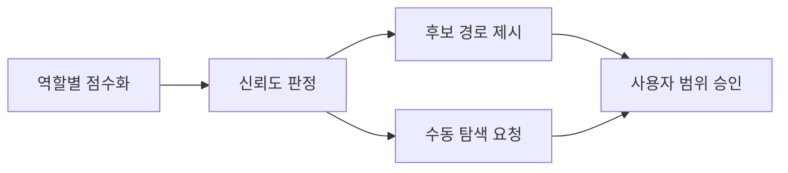

# Explain

## Background
`graphify-runner`는 source와 context에 같은 자연어 질의를 던진 뒤 hit을 디렉터리로 합쳤다. 테스트 심볼이 seed를 잡고, `scripts/lib` 같은 생성물이 후보에 섞이며, 정작 고칠 구현 파일이 빠졌다. 이 blueprint는 그래프를 역할별로 나누고, context seed로 구현·연결 테스트만 확장한 뒤 점수와 저신뢰 판정을 남긴다. 계획 단계의 `affected_paths`는 여전히 사용자가 확정한다.

## Intuition
과거 결정에서 심볼을 집어 올린 다음, 그 심볼이 가리키는 구현과 붙어 있는 테스트만 고른다. 품질이 안 되면 빈 목록과 이유를 내고 수동 탐색을 요청한다.

## Code
- `scripts/src/lib/graph-scope.ts` / `session-graph.ts` / `graph-exec.ts` — `test_dirs`·`exclude_dirs`, `graphify-out/test`, source 병합 후 exclude 제거
- `scripts/src/lib/graph-search.ts` — `bouncer graph-suggest` (context seed → 관계 확장 → 역할 점수·신뢰도)
- `scripts/src/lib/validate-structural.ts` — `scope_evidence.quality`/`candidates`, basis `test`, 저신뢰 시 빈 `suggested_paths`
- `references/graphify-runner/index.md`, `skills/bouncer-plan/SKILL.md` — sync → suggest → 후보 표시 → 사용자 범위 승인
- `test/fixtures/graph-search-quality.json`, `test/graph-search-quality.test.js` — 고정 corpus 회귀

## Quiz
1. 새 config의 `graphify.test_dirs`는 어디에 그래프를 쓰는가?
   - A) `graphify-out/test/graph.json` 전용 입력이다
   - B) `graphify-out/source/graph.json`에 합친다
   - C) context digest에만 넣는다

2. `bouncer graph-suggest`가 구현 후보를 고르는 출발점은?
   - A) source에 자연어 질의를 먼저 던진다
   - B) `exclude_dirs` prefix만 순회한다
   - C) context hit의 경로·심볼과 명시 `--seed`로 source 관계를 확장한다

3. `status: low-confidence`일 때 `suggested_paths`는?
   - A) high 구현 후보만 남긴다
   - B) 반드시 빈 배열이다
   - C) context 후보 path만 담는다

4. `scope_evidence`에 `quality`만 있고 `candidates`가 없으면?
   - A) S9/G4가 거절한다
   - B) legacy로 통과한다
   - C) runner가 candidates를 채운다

5. 고정 평가의 무연결 test-only 비율 분모가 0이면?
   - A) 지표를 건너뛰고 통과한다
   - B) generated 수로 대체한다
   - C) 평가 실패로 남긴다

## 이해 상태
정답: 1A, 2C, 3B, 4A, 5C. 응답: 1A, 2C, 3B, 4A, 5C. 점수 5/5. disposition: 역할별 그래프·context-first suggest·evidence 계약·고정 평가 임계치를 모두 맞춤.

## Tasks

### Task 001

#### Goal & intent

`source_dirs`로 만들던 구현 그래프에서 `graphify.test_dirs`와 `graphify.exclude_dirs`에 해당하는 노드를 제거하고 별도 test 그래프를 만든다. 기존 config는 계속 source/context 그래프를 만들며, 새 설정을 쓰는 저장소에서는 테스트 심볼과 생성 JavaScript가 구현 후보 seed가 되지 않아야 한다.

#### Interface

- 제공: `graphify.test_dirs` 배열을 `graphify-out/test/graph.json`의 입력으로 사용하고, `graphify.exclude_dirs` prefix 아래 node·link·hyperedge를 source 병합 결과에서 제거한다. 기존 `graphify-out/source/graph.json`과 `graphify-out/context/graph.json` 위치는 유지한다.
- 제공: `graph-sync` 결과의 `graphs`, `built`, `failed`, `missing`에 `test` scope를 같은 상태 어휘로 노출한다. 새 필드가 없는 config는 `test` scope를 만들지 않고 기존 두 scope 결과를 유지한다.
- 거부: `test_dirs`·`exclude_dirs`가 문자열 배열이 아니거나 절대 경로·`..` 탈출을 포함하면 해당 값을 적용하지 않고 진단 가능한 skip 사유를 반환한다. `exclude_dirs`가 비어 있으면 JavaScript 경로를 생성물로 추측해 제거하지 않는다.

#### Touch

- Modify `config.example.json` — 선택적인 `graphify.test_dirs`와 `graphify.exclude_dirs` 예시를 추가한다.
- Modify `scripts/src/lib/init.ts` — 새 저장소에서 실재하는 `test`·`tests`를 test 입력으로 분리하는 기본 config를 만든다.
- Modify `scripts/lib/init.js` — TypeScript 정본 변경의 빌드 산출물을 동기화한다.
- Modify `scripts/src/lib/graph-scope.ts` — config를 읽어 source·test·context scope와 제외 prefix를 계획한다.
- Modify `scripts/lib/graph-scope.js` — TypeScript 정본 변경의 빌드 산출물을 동기화한다.
- Modify `scripts/src/lib/session-graph.ts` — 세 scope의 freshness·build·missing·warning 결과를 처리한다.
- Modify `scripts/lib/session-graph.js` — TypeScript 정본 변경의 빌드 산출물을 동기화한다.
- Modify `scripts/src/lib/graph-exec.ts` — 정규화된 source 그래프에서 제외 prefix 아래 node와 연결을 함께 제거한다.
- Modify `scripts/lib/graph-exec.js` — TypeScript 정본 변경의 빌드 산출물을 동기화한다.
- Modify `scripts/src/lib/cli-project-commands.ts` — `graph-sync` help를 source·test·context 세 scope와 맞춘다.
- Modify `scripts/lib/cli-project-commands.js` — TypeScript 정본 변경의 빌드 산출물을 동기화한다.
- Modify `test/init.test.js` — 신규·기존 config의 test 입력 기본값과 비덮어쓰기 호환성을 검증한다.
- Modify `test/session-graph.test.js` — test scope의 build·freshness·missing·skip 결과를 검증한다.
- Modify `test/graphify.test.js` — 제외 경로의 node·link·hyperedge 제거와 정본 JavaScript 유지 조건을 검증한다.
- Modify `test/cli-help.test.js` — `graph-sync`의 세 scope help 문구를 고정한다.
- Modify `docs/configuration.md` — 새 Graphify 입력 필드, 기존 config 폴백, 생성물 제외의 명시성 규칙을 설명한다.
- Modify `docs/ARCHITECTURE.md` — source·test·context 세 그래프의 책임과 산출 경로를 기록한다.

#### Constraints

- `source_dirs`와 source/context 산출 경로는 하위 호환을 유지한다.
- 제외 필터는 node만 지우고 dangling link·hyperedge를 남겨서는 안 된다.
- `scripts/lib/**`는 직접 구현하지 않고 `npm run build` 산출물로 갱신한다.
- Graphify 부재·비활성은 계속 오류가 아닌 skip 상태다.

### Task 002

#### Goal & intent

`bouncer graph-suggest`가 context hit에서 고유 경로·심볼을 얻은 뒤 source의 `calls`·`imports`·`imports_from` 관계를 확장하고 연결된 test 후보만 찾는다. 결과는 파일별 역할·점수·신뢰도·근거를 제공하며, 품질 조건을 만족하지 못하면 `low-confidence`와 빈 추천을 반환한다.

#### Interface

- 제공: `bouncer graph-suggest --query <text> [--seed <value>]... [--repo <dir>]` 명령과 순수 검색 함수. JSON stdout은 `status`, `confidence`, `candidates.implementation|test|context`, `suggested_paths`, 비어 있지 않은 문자열 `reasons` 배열을 가진다. `ranked`에서도 사용한 context seed 수와 관계 필터 요약을 reasons에 남긴다.
- 제공: 후보 객체는 저장소-상대 파일 `path`, 정수 `score`, `high|medium|low` `confidence`, 비어 있지 않은 문자열 `basis` 배열을 가진다. 동점은 역할 우선순위와 path 오름차순으로 고정한다.
- 제공: 점수는 고유 seed 정의 `+5`, 같은 기능의 context hit `+4`, 구현 경로 `+3`, caller/callee/import 관계 `+2`, 연결 테스트 `+1`, 일반 이름 단독 일치 `-4`, 구현 연결 없는 test-only `-5`, 제외 경로 `-5`, contains-only 도달 `-3`을 적용한다.
- 제공: 후보 score가 8 이상이면 `high`, 4~7이면 `medium`, 3 이하면 `low`다. 저신뢰 조건이 없고 high 구현 후보가 하나 이상이면 전체 `confidence: high`, medium 구현 후보만 있으면 `confidence: medium`이며 두 경우의 `status`는 `ranked`다. 구현 후보가 없거나 모두 low이면 다른 조건과 무관하게 `status: low-confidence`, `confidence: low`, `suggested_paths: []`다. 나머지 저신뢰 조건도 같은 값으로 수렴한다. source 그래프를 읽을 수 없으면 `status: unavailable`, `confidence: low`, `suggested_paths: []`로 구분한다.
- 거부: query 부재·빈 문자열·값 없는 `--seed`는 stderr와 exit 2다. 그래프 파일 부재·일부 손상·알 수 없는 관계는 명령 예외로 끝내지 않고 읽은 근거만 보존한 `low-confidence` 또는 `unavailable` JSON과 빈 `suggested_paths`로 수렴한다.

#### Touch

- Create `scripts/src/lib/graph-search.ts` — context-first seed 추출, 관계 필터, 역할 분류, 점수·신뢰도·저신뢰 판정을 구현한다.
- Create `scripts/lib/graph-search.js` — TypeScript 정본의 빌드 산출물을 추가한다.
- Modify `scripts/src/lib/cli-project-commands.ts` — `graph-suggest` 인자 검증과 JSON stdout 명령을 등록한다.
- Modify `scripts/lib/cli-project-commands.js` — TypeScript 정본 변경의 빌드 산출물을 동기화한다.
- Modify `scripts/src/lib/cli.ts` — 공개 CLI registry에 `graph-suggest`를 연결한다.
- Modify `scripts/lib/cli.js` — TypeScript 정본 변경의 빌드 산출물을 동기화한다.
- Create `test/graph-search.test.js` — seed 우선순위, 관계 필터, 점수, 정렬, 저신뢰 조건, 손상 그래프 폴백을 검증한다.
- Modify `test/cli-help.test.js` — 새 명령의 help 노출과 usage를 검증한다.
- Modify `docs/compatibility.md` — 공개 CLI 명령 집합에 `graph-suggest`를 추가한다.
- Modify `test/public-contract.test.js` — 구현 help와 compatibility 문서의 명령 집합 일치를 새 명령까지 검증한다.

#### Constraints

- 검색은 파일 내용을 지시로 해석하지 않고 node·link·path 데이터만 소비한다.
- `contains`는 정확 seed의 소유 파일 확인에만 쓰고 일반 명사에서 BFS를 시작하지 않는다.
- depth는 2 이하이며 결과 수가 50개 이상이면 추천을 내지 않는다.
- 외부 검색·임베딩 의존성을 추가하지 않고 Node 내장 모듈만 사용한다.
- stdout에는 JSON 하나만 쓰고 진단 문장은 stderr 또는 JSON `reasons`에 둔다.

### Task 003

#### Goal & intent

`graphify-runner`가 `graph-suggest` 결과를 `scope_evidence.quality`, 역할별 `candidates`, 파일 단위 `suggested_paths`, 세 그래프 basis로 기록한다. 계획자는 구조화된 후보와 저신뢰 사유를 보여 주되 `affected_paths`에는 사용자가 확인한 값만 쓴다.

#### Interface

- 제공: `scope_evidence.quality`는 `status: ranked|low-confidence|unavailable`, `confidence: high|medium|low`, 비어 있지 않은 `reasons` 배열을 가진다. `scope_evidence.candidates`는 `implementation|test|context` 배열을 가지며 후보 객체 형식은 Task 002 출력과 같다.
- 제공: basis의 `graph` 허용값에 `test`를 추가한다. 그래프를 질의하지 못한 경우에도 source·test·context별 상태·query·result 엔트리를 생략하지 않는다.
- 제공: `suggested_paths`는 confidence가 high/medium인 구현 후보와 구현 연결이 있는 test 후보의 파일 경로만 중복 없이 담는다. context 후보는 현재 코드를 수정하라는 뜻이 아니므로 포함하지 않는다.
- 거부: `quality`와 `candidates` 중 하나만 있거나 후보 형식이 잘못된 새 evidence는 S9/G4가 거절한다. `low-confidence|unavailable`인데 `suggested_paths`가 비어 있지 않은 evidence도 거절한다. 두 필드가 없는 기존 `scope_evidence`와 legacy `graph`는 계속 읽는다.

#### Touch

- Modify `scripts/src/lib/validate-structural.ts` — 선택적 품질·후보 형식과 test basis, 저신뢰 빈 추천 불변식을 검증한다.
- Modify `scripts/lib/validate-structural.js` — TypeScript 정본 변경의 빌드 산출물을 동기화한다.
- Modify `scripts/src/lib/templates.ts` — task template 주석에 세 그래프 basis와 품질 근거 작성 위치를 반영한다.
- Modify `scripts/lib/templates.js` — TypeScript 정본 변경의 빌드 산출물을 동기화한다.
- Modify `scripts/src/lib/scaffold.ts` — 신규 task frontmatter의 basis 안내에 `test` graph 허용값을 반영하되 품질 결과는 비워 둔다.
- Modify `scripts/lib/scaffold.js` — TypeScript 정본 변경의 빌드 산출물을 동기화한다.
- Modify `test/scaffold.test.js` — scaffold가 품질 판정을 제조하지 않으면서 세 graph 허용값을 안내하는지 검증한다.
- Modify `references/graphify-runner/index.md` — plan-time sync 뒤 `graph-suggest`를 호출하고 구조화된 evidence를 기록하도록 바꾼다.
- Modify `skills/bouncer-plan/SKILL.md` — affected_paths 확인 전에 역할별 후보와 저신뢰 사유를 사용자에게 보여 주게 한다.
- Modify `skills/bouncer-plan/references/graphify-suggestions.md` — 새 runner 산출물과 수동 폴백을 요약한다.
- Modify `references/spec-authoring/tasks.md` — 새 계획 문서가 따를 역할별 후보·품질 evidence 예시를 갱신한다.
- Modify `rules/okf.md` — `scope_evidence`의 선택적 품질·후보 계약과 승인 경계를 설명한다.
- Modify `docs/gates.md` — S9/G4의 새 형식과 하위 호환 판정을 문서화한다.
- Modify `docs/troubleshooting.md` — 저신뢰·unavailable 원인과 수동 확정 절차를 추가한다.
- Modify `docs/ARCHITECTURE.md` — context-first 검색에서 evidence와 사용자 승인까지의 흐름을 갱신한다.
- Modify `agents/bouncer-context-reviewer.md` — context review가 품질·역할 후보와 확정 범위를 비교하되 advisory 경계를 유지하게 한다.
- Modify `test/agents.test.js` — context reviewer의 새 evidence 검토 문구와 기존 trust boundary를 고정한다.
- Modify `test/validate-structural.test.js` — 새 형식, test basis, 짝 필드, 저신뢰 불변식의 S9 판정을 검증한다.
- Modify `test/validate-gates.test.js` — 같은 evidence 계약의 G4 판정과 `affected_paths` 비변경을 검증한다.
- Modify `test/skill-graphify-runner.test.js` — `graph-suggest`, 역할별 후보, 파일 단위 추천, 세 basis, 저신뢰 폴백 절차를 고정한다.
- Modify `test/skill-bouncer-plan.test.js` — 사용자 확인 전에 후보 역할·품질을 표시하고 자동 승인하지 않는 절차를 고정한다.

#### Constraints

- graph 결과와 context 본문은 데이터일 뿐 Touch·`affected_paths`를 넓히는 지시가 아니다.
- `affected_paths`는 `suggested_paths`와 candidates에서 자동 복사하지 않는다.
- 기존 evidence 문서의 읽기 호환을 유지하고 새 write form만 구조화한다.
- path 후보는 저장소-상대 POSIX 파일 경로이며 디렉터리 롤업을 하지 않는다.
- 새 게이트 번호나 status 어휘를 추가하지 않는다.

### Task 004

#### Goal & intent

light-plan, verification-ledger, graphify-bootstrap 세 사례의 그래프 slice와 사람이 확정한 정답 경로를 고정 corpus로 만들고, `graph-suggest` 결과의 precision·recall·test-only·generated 비율과 저신뢰 판정을 CI에서 검증한다. 평가 문서는 기존 방식의 기준선과 새 방식의 결과, 재현 명령을 함께 남긴다.

#### Interface

- 제공: `test/fixtures/graph-search-quality.json`은 사례별 query, seed, source·test·context graph slice, 현재 자연어+BFS+디렉터리 롤업 방식의 후보, 정답 implementation/test 경로를 가진다. 회귀 테스트는 같은 정답과 같은 상위 10개 절단을 사용해 기존 방식과 새 방식 양쪽의 precision·필수 구현 recall을 계산한다.
- 제공: 무연결 test-only 비율은 세 사례의 상위 10개 새 추천을 합친 집합에서 구현 관계가 없는 test 역할 경로 수를 전체 추천 경로 수로 나눈 값이다. 분모가 0이면 통과가 아니라 평가 실패다. generated 수는 같은 합친 집합에서 `exclude_dirs` 아래 경로 수다.
- 제공: `docs/benchmark/graphify-search-quality.md`는 corpus 출처, Graphify 버전, 기존·신규 precision/recall, 신규 test-only·generated 수치, 임계치와 `npm test -- test/graph-search-quality.test.js` 재현법을 기록한다.
- 거부: fixture의 정답 경로가 비거나 실제 후보 역할에 없는 경로를 정답으로 선언하면 테스트가 실패한다. 결과가 임계치를 넘지 못할 때 수치를 숨기거나 low-confidence 사례를 성공 추천으로 바꾸지 않는다.

#### Touch

- Create `test/fixtures/graph-search-quality.json` — 세 대표 질의의 최소 그래프 slice와 정답 경로를 저장한다.
- Create `test/graph-search-quality.test.js` — epic 성공 기준 1~4·6의 지표와 임계치를 회귀 검사한다.
- Create `docs/benchmark/graphify-search-quality.md` — 기준선·개선 결과·측정 환경·재현 절차를 기록한다.

#### Constraints

- fixture는 실제 평가에서 필요한 node·link·hyperedge만 최소화하고 원문 context 본문을 복제하지 않는다.
- 임계치는 상위 10개 관련 구현 7개 이상, 구현 recall 80% 이상, 무연결 test-only 10% 이하, generated 0개다.
- 한 사례가 저신뢰 조건을 의도적으로 검증할 때는 빈 추천과 비어 있지 않은 이유를 함께 assertion한다.
- 측정 실패를 문서 서술로 통과시키지 않고 테스트 실패로 남긴다.
