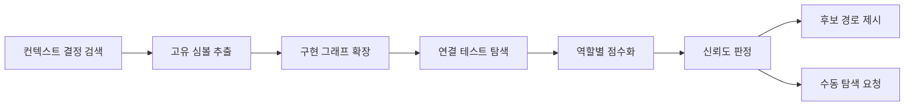

# 001 context-first-ranking

Epic: [060](../../index.md)

## Intent
- 문제: `graphify-runner`가 source와 context에 같은 자연어 질의를 던진 뒤 모든 hit을 디렉터리로 합쳐 테스트 편향, 생성물 중복, 필수 구현 파일 누락을 판별하지 못한다.
- 완료 조건: 역할별 그래프와 context-first 검색을 거친 파일 후보가 점수·근거와 함께 나오고, 품질 조건을 만족하지 못하면 빈 추천과 명시적인 저신뢰 사유가 나온다.

## Contract
- 인터페이스:
  - 기존 `source_dirs`는 구현 그래프 입력으로 유지한다. `graphify.test_dirs`는 테스트 그래프 입력, `graphify.exclude_dirs`는 그래프 병합 뒤 제거할 저장소-상대 경로 prefix다. 두 새 필드가 없는 기존 config는 종전 source/context 그래프를 계속 읽을 수 있다.
  - `bouncer graph-suggest --query <text> [--seed <value>]... [--repo <dir>]`는 context 그래프를 먼저 검색하고, 발견한 경로·심볼과 명시 seed로 source 관계를 확장한 뒤 연결된 test 후보를 반환한다.
  - 명령 stdout은 `status`, `confidence`, 역할별 `candidates`, `suggested_paths`, `reasons`를 가진 JSON 한 개다. 후보는 `path`, `score`, `confidence`, 비어 있지 않은 `basis`를 가진다.
  - `scope_evidence`는 기존 필드에 선택적인 `quality`와 `candidates`를 더한다. 새 필드가 있으면 둘을 함께 검증하며, `status: low-confidence|unavailable`에서는 `suggested_paths`가 반드시 비어야 한다.
- 데이터·상태: `graphify-out/source/graph.json`과 `graphify-out/context/graph.json` 경로는 유지하고 `graphify-out/test/graph.json`을 추가한다. 기존 `scope_evidence`와 legacy `graph` 문서는 읽기 호환하며 `affected_paths` 승인 계약은 바꾸지 않는다.
- 수용 기준: epic 성공 기준 1~8을 모두 충족한다. `suggested_paths`에는 디렉터리 롤업 대신 승인 후보인 구현 파일과 구현 연결이 확인된 테스트 파일만 들어가며 context 문서는 역할별 근거로만 남는다.
- 검증 명령: 각 task에서 `npm test`, 최종 task에서 `npm run ci`.
- 실패 모드·엣지 케이스:
  - `test_dirs` 또는 context 그래프가 없으면 가능한 그래프만 사용하되 누락 사실을 `reasons`와 basis에 남긴다.
  - source 그래프가 없거나 Graphify가 비활성·실패하면 `unavailable`로 수렴하고 runner는 사용자의 수동 범위 확정을 요청한다.
  - 잘못된 JSON, 알 수 없는 관계, 경로 없는 노드는 추천에 포함하지 않는다. 읽을 수 있는 다른 그래프의 근거까지 버리지는 않는다.
  - JavaScript가 정본인 저장소는 `exclude_dirs`를 비우면 JavaScript를 유지한다. `scripts/lib` 같은 생성 경로는 프로젝트가 명시한 경우에만 제거한다.
  - 같은 심볼이 여러 파일에 있으면 단독 고신뢰 seed로 취급하지 않고 반복 이름 감점을 적용한다.

## Out of scope
- Graphify CLI 또는 package/skill 버전 정책 변경.
- 후보를 자동으로 `affected_paths`에 복사하거나 사용자 확인을 생략하는 동작.
- 의미 임베딩, LLM 기반 query rewrite, RDF/OWL과 새 외부 검색 의존성.
- 과거 context 문서의 `affected_paths`나 Touch를 현재 범위로 그대로 복사하는 동작.

## One-commit justification
- blueprint는 한 PR이며 네 task가 각각 한 커밋이다. 그래프 입력, 검색 엔진, 계획 근거 연결, 평가 corpus는 실패 원인과 검토 기준이 달라 분리한다.
- 각 task는 직전 task의 공개 산출물만 소비한다. 어떤 중간 커밋도 기존 source/context 검색과 수동 `affected_paths` 폴백을 깨지 않는다.

## Documents
* [Task 001](tasks/001/tasks.md) - 구현·테스트 그래프 입력 분리
* [Task 002](tasks/002/tasks.md) - context-first 추천 엔진과 CLI
* [Task 003](tasks/003/tasks.md) - runner와 scope evidence 품질 계약
* [Task 004](tasks/004/tasks.md) - 고정 평가 corpus와 품질 문서
* [Context review](context-review.md) - 계획 문서 정합성 판정
<!-- explain.md는 plan scaffold에 포함되지 않습니다. /bouncer-finalize가 작성합니다. -->
