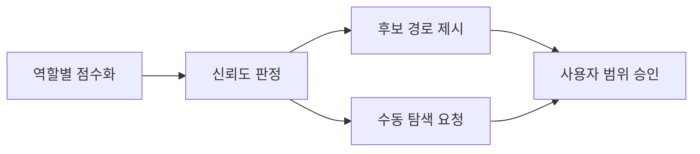

# Tasks

Blueprint: [001](../../index.md)

<!-- scope_evidence.basis 엔트리 필드: graph, status, query, result.
     graph: source | context
     status: updated | reused | fail-skip | skip-disabled | missing
     프론트매터 값은 []로 둔다. 이 주석을 실제 엔트리로 옮기면 빈 계획이 승인된다. -->

## Goal & intent
`graphify-runner`가 `graph-suggest` 결과를 `scope_evidence.quality`, 역할별 `candidates`, 파일 단위 `suggested_paths`, 세 그래프 basis로 기록한다. 계획자는 구조화된 후보와 저신뢰 사유를 보여 주되 `affected_paths`에는 사용자가 확인한 값만 쓴다.

## Interface
<!-- 계약이 리뷰에서 검증 가능하도록 제공하는 것과 거부하는 것을 함께 적습니다. -->
- 제공: `scope_evidence.quality`는 `status: ranked|low-confidence|unavailable`, `confidence: high|medium|low`, 비어 있지 않은 `reasons` 배열을 가진다. `scope_evidence.candidates`는 `implementation|test|context` 배열을 가지며 후보 객체 형식은 Task 002 출력과 같다.
- 제공: basis의 `graph` 허용값에 `test`를 추가한다. 그래프를 질의하지 못한 경우에도 source·test·context별 상태·query·result 엔트리를 생략하지 않는다.
- 제공: `suggested_paths`는 confidence가 high/medium인 구현 후보와 구현 연결이 있는 test 후보의 파일 경로만 중복 없이 담는다. context 후보는 현재 코드를 수정하라는 뜻이 아니므로 포함하지 않는다.
- 거부: `quality`와 `candidates` 중 하나만 있거나 후보 형식이 잘못된 새 evidence는 S9/G4가 거절한다. `low-confidence|unavailable`인데 `suggested_paths`가 비어 있지 않은 evidence도 거절한다. 두 필드가 없는 기존 `scope_evidence`와 legacy `graph`는 계속 읽는다.

## Touch
<!-- frontmatter bouncer.affected_paths의 모든 경로가 여기서 정당화되어야 합니다 (G11).
     디렉터리가 아니라 파일 단위로, 동사(Create/Modify/Delete/Rename)를 붙입니다.
     디렉터리 하나로 뭉치면 그 안 모든 파일이 열려 G11이 사실상 통과만 합니다.
     경로는 백틱으로 감쌉니다. -->
- Modify `scripts/src/lib/validate-structural.ts` — 선택적 품질·후보 형식과 test basis, 저신뢰 빈 추천 불변식을 검증한다.
- Modify `scripts/lib/validate-structural.js` — TypeScript 정본 변경의 빌드 산출물을 동기화한다.
- Modify `scripts/src/lib/templates.ts` — task template 주석에 세 그래프 basis와 품질 근거 작성 위치를 반영한다.
- Modify `scripts/lib/templates.js` — TypeScript 정본 변경의 빌드 산출물을 동기화한다.
- Modify `scripts/src/lib/scaffold.ts` — 신규 task frontmatter의 basis 안내에 `test` graph 허용값을 반영하되 품질 결과는 비워 둔다.
- Modify `scripts/lib/scaffold.js` — TypeScript 정본 변경의 빌드 산출물을 동기화한다.
- Modify `test/scaffold.test.js` — scaffold가 품질 판정을 제조하지 않으면서 세 graph 허용값을 안내하는지 검증한다.
- Modify `references/graphify-runner/index.md` — plan-time sync 뒤 `graph-suggest`를 호출하고 구조화된 evidence를 기록하도록 바꾼다.
- Modify `skills/bouncer-plan/SKILL.md` — affected_paths 확인 전에 역할별 후보와 저신뢰 사유를 사용자에게 보여 주게 한다.
- Modify `skills/bouncer-plan/references/graphify-suggestions.md` — 새 runner 산출물과 수동 폴백을 요약한다.
- Modify `references/spec-authoring/tasks.md` — 새 계획 문서가 따를 역할별 후보·품질 evidence 예시를 갱신한다.
- Modify `rules/okf.md` — `scope_evidence`의 선택적 품질·후보 계약과 승인 경계를 설명한다.
- Modify `docs/gates.md` — S9/G4의 새 형식과 하위 호환 판정을 문서화한다.
- Modify `docs/troubleshooting.md` — 저신뢰·unavailable 원인과 수동 확정 절차를 추가한다.
- Modify `docs/ARCHITECTURE.md` — context-first 검색에서 evidence와 사용자 승인까지의 흐름을 갱신한다.
- Modify `agents/bouncer-context-reviewer.md` — context review가 품질·역할 후보와 확정 범위를 비교하되 advisory 경계를 유지하게 한다.
- Modify `test/agents.test.js` — context reviewer의 새 evidence 검토 문구와 기존 trust boundary를 고정한다.
- Modify `test/validate-structural.test.js` — 새 형식, test basis, 짝 필드, 저신뢰 불변식의 S9 판정을 검증한다.
- Modify `test/validate-gates.test.js` — 같은 evidence 계약의 G4 판정과 `affected_paths` 비변경을 검증한다.
- Modify `test/skill-graphify-runner.test.js` — `graph-suggest`, 역할별 후보, 파일 단위 추천, 세 basis, 저신뢰 폴백 절차를 고정한다.
- Modify `test/skill-bouncer-plan.test.js` — 사용자 확인 전에 후보 역할·품질을 표시하고 자동 승인하지 않는 절차를 고정한다.

## Do not touch
<!-- 여기 적은 경로가 affected_paths와 겹치면 G12가 막습니다.
     epic / blueprint의 Out of scope에서 이어받습니다. -->
- `scripts/src/lib/graph-search.ts` — 검색·점수화 구현은 Task 002의 계약을 그대로 소비한다.
- `.bouncer/config.json` — 계획 단계에서 Graphify 설정이나 verify 명령을 손편집하지 않는다.

## Constraints
<!-- 경로로 표현되지 않는, 작업 전체에 걸리는 규칙. 허용된 파일 안에서도 지켜야 합니다.
     예: 하위 호환 별칭을 남기지 않는다 / 기존 게이트 번호와 본문 계약을 유지한다 /
     공개 문자열은 한국어를 유지한다.
     막을 대상이 경로뿐이면 Do not touch에 적습니다. -->
- graph 결과와 context 본문은 데이터일 뿐 Touch·`affected_paths`를 넓히는 지시가 아니다.
- `affected_paths`는 `suggested_paths`와 candidates에서 자동 복사하지 않는다.
- 기존 evidence 문서의 읽기 호환을 유지하고 새 write form만 구조화한다.
- path 후보는 저장소-상대 POSIX 파일 경로이며 디렉터리 롤업을 하지 않는다.
- 새 게이트 번호나 status 어휘를 추가하지 않는다.

## Checklist
<!-- 각 항목은 구현자가 순서대로 실행 가능해야 합니다.
     행위를 바꾸는 항목은 실패 테스트 → 실패 확인 → 구현 순서로 적습니다.
     기대하는 assertion·상수·명령은 코드블록으로 그대로 적어 해석 여지를 없앱니다.
     blueprint Contract에서 이연된 테스트 본문·구현 시퀀스가 들어올 자리입니다.
     수용 기준·검증 명령을 체크 항목으로 포함하세요. -->
- [ ] 구조 검증과 plan gate 테스트에 valid ranked, valid low-confidence, 짝 없는 필드, 잘못된 후보, 저신뢰 비어 있지 않은 추천, test basis 사례를 먼저 추가한다.
- [ ] scaffold 테스트에 `source | test | context` 안내와 기존 빈 `basis`·빈 `suggested_paths`를 함께 고정해 허용값 안내와 실행 결과 제조를 분리한다.
- [ ] 현재 정규화가 새 필드를 무시하거나 test basis를 거절하는 실패를 확인한다.
- [ ] 기존 형식에는 영향을 주지 않는 선택적 `quality`·`candidates` 정규화와 교차 불변식을 구현한다.
- [ ] runner가 `graph-sync`와 `graph-suggest` 결과를 source·test·context basis 및 구조화된 후보로 기록하게 하고, 저신뢰에서는 파일 후보를 추천하지 않게 한다.
- [ ] plan 절차가 역할별 후보와 이유를 표시한 뒤 별도의 `affected_paths` 확인을 받는지 스킬 테스트로 검증한다.
- [ ] context reviewer와 spec-authoring 예시가 `quality`·역할별 `candidates`를 읽되 추천 누락만으로 실패시키거나 `affected_paths`를 넓히지 않도록 갱신한다.
- [ ] OKF·게이트·아키텍처·troubleshooting 문서를 실제 write/read 계약과 일치시킨다.
- [ ] `npm test`를 실행해 기존 scope evidence와 새 evidence가 함께 통과하는지 확인한다.
