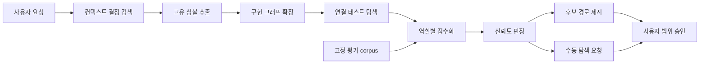

# 060 graphify-search-quality

## Intent
- 문제: 자연어 질의가 일반적인 테스트 심볼에서 시작해 `contains` 관계로 팽창하고, 생성 JavaScript까지 섞인 결과를 디렉터리로 롤업하면서 실제 구현 경로를 누락한다.
- 목표: 과거 결정에서 고유 심볼을 얻고 구현·테스트 관계를 분리해 탐색하며, 파일별 역할·점수·신뢰도를 근거와 함께 제시하고 불확실하면 추천을 포기한다.

## Success criteria
1. 고정 평가 질의별 상위 10개 후보 가운데 관련 구현 파일이 7개 이상이다.
2. 고정 평가 corpus의 필수 구현 경로 recall이 80% 이상이다.
3. 세 사례의 상위 10개 추천을 합친 집합에서 구현 관계가 없는 test-only 경로 수를 전체 추천 경로 수로 나눈 비율이 10% 이하이며, 전체 추천 경로 수는 1개 이상이다.
4. 생성 JavaScript 경로가 추천 결과에 하나도 없다.
5. 구현·테스트·과거 맥락 후보를 역할별로 구분하고 각 후보의 점수·신뢰도·근거를 기계적으로 읽을 수 있다.
6. 구현 후보 부재, 일반 단어만 있는 seed, 50개 이상 결과 폭발, test-only 상위 결과, source/context 연결 부재 중 하나가 발생하면 `low-confidence`와 빈 `suggested_paths`를 기록한다.
7. Graphify 부재·비활성·질의 실패 시 비어 있지 않은 basis를 남기고 수동 탐색으로 돌아가며 `affected_paths`는 계속 사용자만 확정한다.
8. 저장소 전체 `npm run ci`가 통과하고 세 고정 질의의 전후 precision·recall이 평가 문서에 남는다.

## Out of scope
- Graphify 외부 패키지의 그래프 스키마·질의 구현 수정.
- Graphify를 필수 의존성으로 바꾸거나 설치 실패를 Bouncer 초기화 실패로 승격하는 작업.
- `scope_evidence.suggested_paths`가 `affected_paths`를 자동으로 덮어쓰게 하는 작업.
- 기존 context 다이제스트·`supersedes` 계보의 재구축과 과거 문서 소급 저술.
- 실제 사용자 작업 10~20개의 장기 on/off 제품 실험 완료. 이번에는 반복 가능한 고정 corpus와 측정 절차까지만 제공한다.

## Blueprints
<!-- OKF §6 인덱스 형식. 새 blueprint를 만드는 기준은 하나 — 한 커밋으로
     리뷰 가능한 단위인가. 더 크면 blueprint를 쪼갠다. 하위 태스크 계층은
     만들지 않는다 (rules/governance.md).
     한 줄 목적에는 무엇이 바뀌는지(what)와 어디를 건드리는지(where)를
     함께 적는다. 기존 라인은 소급 수정하지 않는다. -->
* [컨텍스트 우선 경로 추천](blueprints/001-context-first-ranking/index.md) - 그래프 입력을 역할별로 분리하고 `graph-suggest` 검색·점수화와 `scope_evidence` 품질 근거를 구현한다
