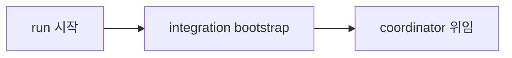
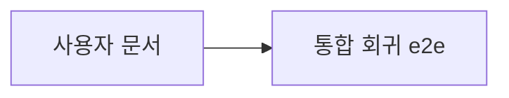

# Explain

## Background

`/bouncer-run`은 task를 번호 순서로 하나씩 열고, 실행 세션이 직접 구현·검증·커밋을 몰았다.
그래서 서로 의존하지 않는 task도 앞 task가 끝나야 시작할 수 있었고, 실행 중 계획이 어긋나면
`/bouncer-plan`으로 후퇴하는 길밖에 없었다. 모든 task가 blueprint당 하나의 shared worktree를
같이 썼기 때문에 병렬로 벌리려 해도 서로의 파일을 덮어쓸 수밖에 없었다.

이 Blueprint는 그 구조를 바꾼다. 계획이 task 사이의 의존 그래프를 선언하고, `/bouncer-run`은
승인 뒤 named coordinator 하나에게 Blueprint 완료 권한을 위임한다. coordinator는 격리된
worktree에서 준비된 task 묶음을 계산해 worker에게 나눠 주고, 보고를 판정해 통합 순서를 정하며,
실행 중 발견한 drift를 후퇴 없이 스스로 해결한다. 그 모든 판단은 런타임 원장에 남아 중단된
drive를 같은 자리에서 재개할 수 있게 한다.

## Intuition

번호표를 뽑고 한 줄로 서던 창구를, 의존 관계를 아는 관리자 한 명이 여러 창구로 배치하는 구조로
바꾼 것이다. 관리자는 자기 책상(integration worktree)에서만 장부를 쓰고, 직원들은 각자 배정된
책상(worker worktree)에서만 일한다. 원본 저장소는 아무도 손대지 않는 열람용이다. 누가 무엇을
왜 했는지는 장부 한 권에 남아, 관리자가 자리를 비웠다 돌아와도 하던 곳부터 이어 간다.

## Code

읽어야 할 순서는 계약 → 실행 코어 → 위임 → 경계다.

- `scripts/src/lib/schema.ts` — task frontmatter의 `depends_on`, `parallel_safe`,
  `dependency_gate`. 세 번째 값은 `integrated` 하나만 받는다. 어떤 실행 경로도 만들지 못하는
  값이 하나 있었고 이 Blueprint에서 걷어냈다.
- `scripts/src/lib/coordinator.ts` — 실행 코어. `transition()`이 허용하는 다섯 상태
  (`pending → ready → prepared → recorded → integrated`)와, 선행 task의 상태를 후속이 선언한
  gate와 비교해 ready wave를 계산하는 `readyWave()`가 핵심이다. `coordinate()`의 일곱 서브커맨드
  (`bootstrap`, `prepare`, `ready`, `record`, `integrate`, `status`, `revise`)가 전부다.
- `scripts/src/lib/runtime-state.ts` — worktree 배치. integration은 `.worktrees/<epic>/<bp>`,
  worker는 그 아래 `workers/<NNN>`.
- `agents/bouncer-coordinator.md`와 `skills/bouncer-run/SKILL.md` — 위임 계약. run은 start ACQ
  뒤 coordinator를 한 번 디스패치하고 최종 결과만 회수한다.
- `scripts/src/lib/scope.ts` — 가장 많이 바뀐 파일이다. 원장 잠금의 상호배제
  (`withLedgerLock`, `reclaimStaleLock`), 실행 중 scope 개정(`reviseTaskScope`), 실제 변경 경로
  기록(`recordActualPaths`), 그리고 런타임 산출물 판정(`RUNTIME_ARTIFACTS`, `isRuntimeArtifact`)이
  모두 여기 있다.
- `test/coordinator-e2e.test.js` — 실제 Git fixture에서 순차·병렬 drive와 재개를 돌린다. mock
  scheduler 없이 production `coordinate()`를 구동하고, main worktree의 tracked source가
  시작·종료에 byte 단위로 같은지 단정한다.

사용자 문서는 `docs/workflow.md`(흐름), `docs/cli.md`(`coordinate` 서브커맨드와 거절 코드),
`docs/troubleshooting.md`(중단·재개 복구)를 그 순서로 읽으면 된다.

실행하면서 드러난 제약 셋은 코드를 읽기 전에 알아 두는 편이 낫다.

- `bouncer commit`의 메시지 생성기는 `commit_intent`·`commit_summary`에서 소문자 라틴
  식별자를 전부 거절한다. 파일·모듈 이름뿐 아니라 `enum`이나 `lock` 같은 평범한 낱말도
  걸리고, 계획 승인이 아니라 커밋 시점에야 드러난다.
- `npm run check:emit`은 `scripts/lib`의 **unstaged** diff를 본다. 그래서 소스를 고친 뒤
  스테이징 전까지는 구조적으로 실패한다. emit이 소스와 맞는지는 재빌드 후 해시를 비교해
  확인해야 한다.
- `npm run ci`에 들어 있는 `lint:context-comments`는 `.bouncer/context/**` 어느 문서든
  스캐폴드 안내 주석이 남아 있으면 실패한다. 다른 task의 `review.md` 하나가 전체 CI 게이트를
  막을 수 있다.

## Quiz

**Q1.** `readyWave()`가 후속 task를 열지 결정할 때 무엇과 무엇을 비교하는가?

1. 후속 task의 `parallel_safe`와 현재 실행 중인 worker 수
2. 선행 task의 현재 상태와 후속 task가 선언한 `dependency_gate`
3. 선행 task의 `commit_sha`와 integration branch의 HEAD

**Q2.** `bootstrap`이 main checkout에서 하는 일은 무엇인가?

1. Git worktree 등록과 integration worktree 생성만 하고 source는 쓰지 않는다
2. tracked source를 수정해 원장 초기값을 커밋한다
3. 모든 worker worktree를 미리 만들고 task 문서를 배포한다

**Q3.** 실행 중 승인된 `affected_paths` 밖을 고쳐야 한다는 것이 드러나면 무엇이 일어나는가?

1. `/bouncer-plan`으로 후퇴해 계획을 다시 승인받는다
2. 그 task를 blocked로 두고 다음 wave로 넘어간다
3. coordinator가 현재 task scope와 원장을 갱신하고 같은 drive에서 계속한다

**Q4.** 방치된 원장 잠금을 회수하다가 그 사이 제3자가 자리를 차지하면 어떻게 되는가?

1. 하드링크 복원이 `EEXIST`로 실패해 덮어쓰지 않고 회수 실패로 물러난다
2. 이름 바꾸기로 덮어쓰고 원래 소유자에게 알린다
3. 두 소유자가 모두 임계 구역에 들어간 뒤 나중에 조정한다

**Q5.** `.bouncer/runtime/`의 coordinator 원장은 커밋 범위 검사에서 어떻게 취급되는가?

1. 컨텍스트 문서와 같이 취급돼 finalize가 커밋한다
2. 추적되지도 무시되지도 않아 스테이징되면 커밋이 막힌다
3. 런타임 산출물이라 범위 위반으로 보고되지 않고, `bouncer init`이 무시 목록으로 안내한다

## 이해 상태

퀴즈 5문항, 정답 5개 — `5/5`.

| 문항 | 정답 | 응답 | 판정 |
| --- | --- | --- | --- |
| Q1 `readyWave()`의 비교 대상 | 2 | 2 | 정답 |
| Q2 `bootstrap`의 main checkout 작업 | 1 | 1 | 정답 |
| Q3 실행 중 scope 이탈 처리 | 3 | 3 | 정답 |
| Q4 회수 경합에서 제3자 잠금 | 1 | 1 | 정답 |
| Q5 원장의 커밋 범위 검사 지위 | 3 | 3 | 정답 |

이 Blueprint의 네 축 — 실행 코어의 wave 판정, worktree 격리 경계, 후퇴 없는 drift 해결,
원장의 런타임 산출물 지위 — 이 모두 확인됐다. 후속 설명이 필요한 지점은 없다.

## Tasks

### Task 001

#### Goal & intent

task 번호를 표시·기본 정렬에만 쓰고 `depends_on`, `parallel_safe`, `dependency_gate`가 실행 가능성을 결정하게 함 full plan은 유효한 DAG와 병렬 자격을 승인 전에 검증해야 함

#### Interface

- 제공: task `bouncer.depends_on`은 `TASKS-NNN` id 배열, `parallel_safe`는 boolean, `dependency_gate`는 `integrated`다(도입 당시에는 `integration-verified`도 열거했으나, 어떤 실행 경로도 그 상태를 만들지 못해 TASKS-007이 값을 제거했다). 필드가 없는 기존 task는 dependency 없는 순차 정렬 입력으로 읽는다.
- 거부: 알 수 없는 task, 자기 참조, 중복 dependency, cycle, enum 밖 상태, boolean이 아닌 병렬 선언을 path가 포함된 plan-gate 오류로 거절한다.

#### Do not touch

- `scripts/src/lib/runtime-state.ts` — worktree와 ledger 구현은 Task 002가 소유한다.
- `skills/bouncer-run/SKILL.md` — coordinator 디스패치는 Task 003이 소유한다.
- `agents/bouncer-implementer.md` — worker 권한 변경은 Task 005가 소유한다.

### Task 002

#### Goal & intent

coordinator가 DAG 상태와 Git fan-out/fan-in을 재현 가능한 CLI 코어로 운용하게 한다. 파일 쓰기는 할당된 task/integration worktree로 제한하고 main worktree source mutation은 명령 실행 전에 막는다.

#### Interface

- 제공: root run은 main checkout에서 source를 쓰지 않는 `bouncer coordinate bootstrap`으로 integration branch/worktree만 생성한다. 이후 `prepare|ready|record|integrate|status`는 integration worktree에서 JSON으로 ready wave, task 상태, worker commit과 decision log를 반환한다. `ready`는 각 task의 `depends_on`·`parallel_safe`·`dependency_gate`를 읽어 선행 task가 요구 상태에 도달한 경우만 열고, 순차 task는 결정적 단일 wave로, 병렬 허용 task만 같은 wave로 반환한다. layout은 `.worktrees/<epic>/<blueprint>/integration`과 `.worktrees/<epic>/<blueprint>/workers/<task>`다.
- 거부: bootstrap 이외 명령의 main checkout cwd, Blueprint 밖 task, ready가 아닌 실행, stale integration HEAD, 중복 fan-in, 할당되지 않은 worktree와 불법 상태 전이를 비파괴 오류로 거절한다. 기존 worker 경로는 Git이 등록한 worktree이고 realpath가 할당 worker 경계 안일 때만 seed·write한다. bootstrap도 main checkout의 tracked/untracked source write를 요청하면 거절한다.

#### Do not touch

- `scripts/src/lib/current.ts` — pointer와 동적 scope 연결은 Task 004가 소유한다.
- `agents/bouncer-coordinator.md` — agent 역할은 Task 003이 소유한다.
- `skills/bouncer-finalize/SKILL.md` — 완료 workflow는 Task 005가 소유한다.

### Task 003

#### Goal & intent

`/bouncer-run`이 start ACQ 뒤 `bouncer-coordinator`를 디스패치하고 Blueprint의 남은 실행을 위임한다. coordinator는 전용 코어를 호출하고 역할별 worker를 관리하며 root run은 진행·최종 보고만 렌더링한다.

#### Interface

- 제공: named `bouncer-coordinator`는 Blueprint, base, integration-local ledger, Distill preflight와 사용자 start 선택을 입력으로 받고 progress와 terminal outcome을 반환한다. named agent를 지원하지 않는 host는 같은 역할 계약의 generic subagent를 한 번 디스패치한다.
- 거부: coordinator를 띄우지 않은 inline drive, root run의 직접 code edit, start 승인 없는 dispatch, main worktree를 write cwd로 전달한 payload를 거절한다.

#### Do not touch

- `scripts/src/lib/coordinator.ts` — 결정적 실행 코어는 Task 002가 소유한다.
- `agents/bouncer-implementer.md` — worker authority 전환은 Task 005가 소유한다.
- `docs/workflow.md` — 사용자 문서는 Task 006이 소유한다.

### Task 004

#### Goal & intent

coordinator mode에서 plan의 `affected_paths`를 초기 예상치로 취급하고, coordinator가 실행 중 발견한 필수 경로와 task 계약을 ledger와 task 문서에 갱신한다. commit-safety는 main worktree 금지, 할당 worktree, 현재 scope와 실제 staged path를 함께 검사한다.

#### Interface

- 제공: coordinator가 기록한 graph revision과 task scope가 commit authorization의 정본이 되고 commit 결과는 actual paths, worker SHA, integration SHA와 다음 ready wave를 반환한다.
- 거부: 일반 execute의 미승인 scope 확장, main worktree source diff, coordinator ledger와 task 문서 revision 불일치, 할당 worktree 밖 staged path, 설명 없는 새 task·edge를 commit 전에 거절한다.

#### Do not touch

- `skills/bouncer-execute/SKILL.md` — workflow 절차는 Task 005가 소유한다.
- `scripts/src/lib/finalize.ts` — 완료·explain 기록은 Task 005가 소유한다.
- `docs/gates.md` — 사용자 문서는 Task 006이 소유한다.

### Task 005

#### Goal & intent

implementer, debugger, reviewer는 전용 worktree에서 역할별 결과를 coordinator에게 반환하고, coordinator는 planning 후퇴 없이 scope·task·재작업을 판정한다. 모든 task가 통합 검증을 통과하면 coordinator가 explain, finalize commit과 draft PR까지 닫는다.

#### Interface

- 제공: execute·commit·finalize는 coordinator context를 입력으로 받아 worker dispatch, integration 검증, explain audit와 PR 결과를 coordinator에게 반환한다. worker의 `Needs planning`은 coordinator의 `Decision required`로 바뀌어 task/graph/scope 조정 입력이 된다.
- 제공: `bouncer coordinate revise --blueprint <dir> --task <NNN> --paths 
 [--paths 
…] --reason <r>`가 `reviseTaskScope`를 호출해 coordinator의 scope 판정을 task 문서와 ledger에 같은 revision으로 기록한다. 성공은 revision과 이전·다음 경로를 JSON으로 내보내고, 거절은 `reviseTaskScope`의 reason 코드를 종료 코드 1과 함께 stderr로 옮긴다.
- 거부: worker의 pointer·status·integration·PR 직접 수정, main worktree write cwd, 검증되지 않은 fan-in, unresolved reviewer finding을 완료로 기록하는 동작을 거절한다.

#### Do not touch

- `scripts/src/lib/coordinator.ts` — ledger와 Git 상태 전이는 Task 002가 소유한다.
- `docs/workflow.md` — 사용자 설명은 Task 006이 소유한다.
- `scripts/src/lib/scope.ts` — `reviseTaskScope` 본체와 ledger lock은 Task 008이 소유한다. 이 task는 호출만 한다.

### Task 006

#### Goal & intent

사용자가 coordinator의 권한, DAG 상태, worktree 격리, 중단·재개와 감사 기록을 문서만으로 운용할 수 있게 한다. 실제 Git repository fixture에서 단일 task와 병렬 wave가 main source mutation 없이 하나의 PR branch로 끝나는지 증명한다.

#### Interface

- 제공: workflow, architecture, CLI, gate, configuration, troubleshooting 문서가 plan→run coordinator→worker wave→fan-in→finalize 흐름과 복구 명령을 같은 용어로 설명한다.
- 거부: 기존 blueprint당 shared worktree 설명, scope drift의 `/bouncer-plan` 후퇴 안내, coordinator가 main worktree에서 수정하는 예시, 검증되지 않은 PR 완료 주장을 문서·통합 테스트에서 거절한다.

#### Do not touch

- `scripts/src/lib/coordinator.ts` — 실행 코어 변경은 Task 002에서 끝낸다.
- `skills/bouncer-run/SKILL.md` — dispatch 계약 변경은 Task 003에서 끝낸다.
- `.bouncer/Distill.md` — durable promotion은 `/bouncer-finalize`가 소유한다.

### Task 007

#### Goal & intent

`dependency_gate`의 `integration-verified`는 어떤 실행 경로도 그 상태를 만들지 못한다. `transition()`은 `pending → ready → prepared → recorded → integrated`만 허용하고 종단 상태를 쓰는 곳은 `integrate` 하나인데, `readyWave`는 선행 task의 status를 successor가 선언한 gate와 그대로 비교한다. 그래서 이 값을 고른 successor는 기다리는 게 아니라 영구히 열리지 않는다. 값을 계약에서 없애 계획자가 고를 수 없게 한다.

에픽 성공 기준 6은 "각 반영 뒤 요구된 검증을 통과시킨다"로 모든 fan-in에 검증을 무조건 요구한다. 따라서 `integrated`가 이미 "통합되고 검증됨"이며 더 엄격한 별도 값은 구분할 실체가 없다. 이 task는 기능을 빼는 게 아니라 실체 없는 선택지를 걷어낸다.

#### Interface

- 제공: `dependency_gate`는 `integrated` 하나만 받는다. 부재는 그대로 `integrated`로 읽는다. S28은 그 밖의 값을 종전과 같은 코드로 거절하되, 이제 `integration-verified`도 거절 대상이다.
- 제공: 정본 규칙(`rules/okf.md`, `rules/governance.md`), 계획 참조(`references/spec-authoring/index.md`, `skills/bouncer-plan/SKILL.md`), 사용자 문서(`docs/gates.md`), scaffold 템플릿 주석이 모두 한 값만 말한다. `docs/ARCHITECTURE.md`는 TASKS-006이 이미 다섯 상태만 적어 이 task의 대상이 아니다.
- 거부: `transition()`에 새 간선을 더하거나 `readyWave`의 비교 방식을 바꾸는 변경을 거절한다. `task.dependency_gate || 'integrated'` 폴백은 값이 하나가 되어도 그대로 성립하므로 건드리지 않는다.

#### Do not touch

- `scripts/src/lib/validate-structural.ts` — S28은 enum을 import만 하므로 이 변경으로 바뀔 코드가 없다.
- `scripts/src/lib/finalize.ts` — 원장 provenance는 TASKS-005가 끝냈다.
- `.bouncer/Distill.md` — durable promotion은 `/bouncer-finalize`가 소유한다.

### Task 008

#### Goal & intent

방치 lock 회수가 다른 프로세스의 lock을 덮어쓰지 못하게 하고, 소유를 잃은 writer가 ledger에 쓰기 **전에** 그 사실을 알아차리게 한다. 회수는 여전히 take-then-check라 두 writer가 임계 구역에 함께 들어가는 창 자체는 남지만, 늦게 알아차린 쪽이 ledger를 덮어쓰는 대신 `ledger-lock-lost`로 물러난다. `rules/governance.md`의 Dynamic plan 문장은 그 결과를 그대로 말한다.

#### Interface

- 제공: `withLedgerLock`은 ledger에 쓰기 직전에 소유 토큰을 다시 확인해, 회수 경합으로 lock을 잃은 writer가 쓰지 못하게 막는다. 방치 lock 회수는 관측한 토큰과 일치할 때만 삭제하고, 토큰이 다르면 복원을 시도하되 자리가 점유돼 있으면 덮어쓰지 않고 회수 실패로 물러난다.
- 제공: 복원 실패는 세 갈래다. 자리가 점유됐으면(`EEXIST`) 덮어쓰지 않고 회수 실패로 물러난다. 하드링크를 걸 수 없으면(미지원 파일시스템, `protected_hardlinks` 등) 이전 구현과 같은 이름 바꾸기 복원으로 물러나며, **이 갈래에서는 비덮어쓰기 보장이 성립하지 않는다** — 밀려난 획득자는 쓰기 직전 소유 확인에서 걸러진다. 그 밖의 실패는 삼키지 않고 올리되 park 사본을 남겨 원 소유자 레코드가 소실되지 않게 한다.
- 거부: 시한 내에 획득하지 못하면 `{ ok: false, reason: 'ledger-locked' }`, 임계 구역 도중 소유를 잃으면 `{ ok: false, reason: 'ledger-lock-lost' }`로 거절한다. 후자는 쓰기 전에 판정하므로 ledger가 이미 오염된 뒤의 사후 보고가 아니다.

#### Do not touch

- `scripts/src/lib/commit-hook.ts` — 커밋 안전성 집행은 Task 004가 끝냈고 lock 계약 변경만으로 바뀌지 않는다.
- `scripts/src/lib/coordinator.ts` — ledger 상태 전이는 Task 002가 소유한다.
- `test/master-rules.test.js` — 이 파일의 문구 정본 단언은 Task 005가 만들었고 `dependency_gate` 열거 단언은 Task 007이 고친다. 이 task는 lock 계약 문구만 본다.
- `scripts/src/lib/cli-git-commands.ts` — `coordinate revise` 표면은 Task 005가 소유한다.

### Task 009

#### Goal & intent

coordinator 원장은 실행 상태이지 컨텍스트 문서가 아니라는 것이 이 블루프린트의 결정이다. 그런데 `RUNTIME_ARTIFACTS`에도 `SUGGESTED_IGNORES`에도 `.bouncer/runtime/`이 없어, 소비자 저장소에서 원장은 추적되지도 무시되지도 않은 채 남고 스테이징되면 범위 위반으로 커밋을 막는다. 이 저장소는 `.gitignore`에 손으로 넣어 두어 그 사실이 가려져 있었다. 결정을 코드가 집행하게 만든다.

#### Interface

- 제공: `isRuntimeArtifact`가 `.bouncer/runtime/` 아래 경로를 런타임 산출물로 판정한다. 이 task는 그 술어를 커밋 범위 검사에서 회귀로 고정한다. `finalize.ts`와 `validate-gates.ts`도 같은 술어를 쓰므로 함께 바뀌지만, 그 두 소비처의 회귀는 TASKS-010의 전체 CI가 덮는다.
- 제공: `bouncer init`이 제안하는 `.gitignore` 블록에 `.bouncer/runtime/`이 들어가, 새 저장소는 처음부터 원장을 추적하지 않는다.
- 거부: 원장을 커밋 대상으로 만들거나, `.bouncer/` 전체를 무시 대상으로 넓히는 변경을 거절한다. 계약은 `runtime/` 하위 한 갈래에만 적용된다.

#### Do not touch

- `.gitignore` — 이 저장소가 손으로 넣어 둔 항목은 그대로 둔다. 이 task는 규칙을 고치지 저장소 로컬 설정을 고치지 않는다.
- `scripts/src/lib/coordinator.ts` — 원장을 쓰는 쪽 로직은 TASKS-002가 끝냈다.
- `.bouncer/Distill.md` — durable promotion은 `/bouncer-finalize`가 소유한다.
- `CHANGELOG.md` — 지난 커밋 시점의 사실 기록이므로 같은 목록을 값으로 나열하더라도 소급하지 않는다.

### Task 010

#### Goal & intent

Task 001–009가 integration branch에 반영된 뒤 `npm run ci`를 실행하고 실패를 0개로 만든다. 실패가 있으면 coordinator가 원인 task와 실제 수정 경로를 기록하고 할당 worktree에서 역할별 agent를 디스패치해 수정·재통합한다.

#### Interface

- 제공: 최종 verification은 명령, 시작·종료 SHA, exit code, 실패 원인과 수정 commit을 coordinator ledger와 verification evidence에 기록한다.
- 거부: 일부 focused test만으로 CI 통과를 대신하는 처리, 실패 assertion 삭제·약화, main worktree 수정, 미해결 실패를 성공으로 기록하는 처리를 거절한다.

#### Do not touch

- `task-dag-parallel-execution.md` — 입력 제안서는 계획·구현 산출물이 아니다.
- `.bouncer/Distill.md` — durable promotion은 finalize 단계가 소유한다.