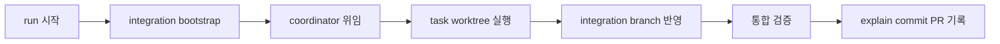

# DAG 코디네이터 위임 실행

Epic: [067](../../index.md)

## Intent

실행 워크플로가 이름 붙은 조정자에게 청사진 완료 권한을 위임하고, 조정자가 격리된 작업 공간에서 의존 그래프 조정부터 검증·기록·병합 요청까지 끝내도록 함. 실행 중 발견한 계획 이탈은 후퇴 없이 조정자가 해결하고 실제 결정과 경로를 감사 기록으로 남김.

## Contract

- 인터페이스: task frontmatter는 `depends_on`, `parallel_safe`, `dependency_gate`를 제공한다. `/bouncer-run`은 opt-in 필드 없이 start ACQ 뒤 coordinator를 디스패치하고 최종 outcome만 회수한다.
- 데이터·상태: 승인 시점 DAG는 초기 기준선이다. coordinator ledger는 현재 graph revision, task 상태, worker branch/worktree, commit SHA, integration 상태, 실제 변경 경로와 판단 로그를 할당된 integration worktree의 `.bouncer/runtime/coordinator.json`에 저장한다.
- 원장 경계: 원장은 런타임 산출물이다. 커밋 범위 검사가 위반 후보에서 제외하고, `bouncer init`은 `.bouncer/runtime/`을 `.gitignore` 제안 블록에 넣는다. 컨텍스트 문서가 아니므로 `.bouncer/context/` 규칙을 따르지 않는다.
- 실행 권한: coordinator는 Blueprint 완료에 필요한 task·edge·scope·체크리스트를 변경하고 새 task를 만들 수 있다. `affected_paths`는 coordinator mode에서 초기 예상 경로이며 commit gate는 coordinator가 기록한 현재 task scope와 실제 경로를 사용한다.
- 격리 경계: root run의 `coordinate bootstrap`만 main checkout에서 Git worktree 등록을 수행하며 tracked/untracked source를 쓰지 않는다. bootstrap이 integration worktree를 만든 뒤 coordinator와 쓰기 worker는 할당된 task/integration worktree 안에서만 파일을 수정하고, 경로 검증 실패나 worktree 밖 cwd를 거절한다.
- 위임 경계: implementer, debugger, reviewer는 coordinator가 디스패치한다. coordinator가 보고를 판정하고 재작업·task 변경·fan-in을 결정하며 일반 worker는 integration state, pointer, explain, PR을 직접 소유하지 않는다.
- 통합: dependency는 선행 task가 `integrated`에 닿을 때 해제한다. Epic success criteria 6이 모든 fan-in 뒤 검증을 요구하므로 `integrated`가 곧 통합·검증 완료이며, `dependency_gate`는 그 한 값만 받는다. worker commit은 dependency 순서로 integration branch에 `cherry-pick`한다.
- 완료: coordinator가 모든 task를 `integrated`로 만들고 그 통합 HEAD의 검증을 확인한 뒤 finalize, explain, commit, draft PR을 수행한다. 실행 중 변경된 계획, 실제 path, agent provenance와 실패 복구 이력은 explain과 PR에 남긴다.
- 수용 기준: Epic success criteria 1–10을 모두 만족하고 기존 단일 task·순차 Blueprint 회귀가 통과해야 한다.
- 이연 항목: TASKS-008 리뷰가 남긴 두 건을 이 Blueprint 밖 후속 계획으로 넘긴다. 소유자는 lock 계약을 다시 여는 다음 유지보수 Blueprint다. (1) 하드링크 불가 폴백은 이름 바꾸기 복원이라 그 갈래에서 비덮어쓰기 보장이 성립하지 않는다. 이는 TASKS-008 Interface가 명시한 계약 예외이며, 회귀가 조건 2종 중 `EPERM` 하나만 태워 `ENOTSUP`은 고정되지 않은 상태다. 예외를 없애려면 링크 없이 원자적으로 자리를 되찾는 다른 원시연산이 필요하다. (2) `test/commit-task.test.js`가 스칼라 비교에 `deepStrictEqual`을 쓴다. 둘 다 현재 검증은 통과하며 실패 테스트가 아니다.
- 검증 명령: `npm run ci`
- 실패 모드·엣지 케이스: cycle, 누락 task, 중복·자기 edge, 충돌 scope, worker 부분 실패, stale worker base, cherry-pick 충돌, integration-only 실패, coordinator 재시작과 orphan worktree를 명시적으로 거절하거나 기록된 상태에서 복구한다. 외부 권한·자격 증명·파괴적 변경이 필요하면 현재 상태를 보존하고 중단하되 `/bouncer-plan`으로 후퇴하지 않는다.

## Out of scope

- cross-blueprint DAG와 remote worker pool
- main worktree source mutation을 허용하는 예외 또는 fallback
- 파괴적 저장소 작업, credential 사용, host permission 우회 권한 위임
- 완료된 plan·explain·commit history의 소급 migration

## One-commit justification

- 이 Blueprint는 한 PR 단위다. 내부 열 task가 각각 계획 계약, 실행 코어, coordinator 배포, 동적 scope, workflow 완료, 문서·통합 회귀, 도달 불가 게이트 값 제거, ledger lock 상호배제, 원장 런타임 경계, 전체 CI를 독립 commit으로 닫는다.

## Documents

* [Task 001](tasks/001/tasks.md) - DAG 계획 스키마와 plan gate
* [Task 002](tasks/002/tasks.md) - coordinator ledger와 worktree 실행 코어
* [Task 003](tasks/003/tasks.md) - named coordinator 배포와 run 디스패치
* [Task 004](tasks/004/tasks.md) - 동적 scope와 coordinator commit 계약 전환
* [Task 005](tasks/005/tasks.md) - worker 위임과 coordinator 완료 흐름
* [Task 006](tasks/006/tasks.md) - 사용자 문서와 end-to-end 회귀
* [Task 007](tasks/007/tasks.md) - 도달 불가능한 의존 게이트 값 제거
* [Task 008](tasks/008/tasks.md) - ledger lock 상호배제 완성
* [Task 009](tasks/009/tasks.md) - 원장의 런타임 산출물 경계 확정
* [Task 010](tasks/010/tasks.md) - 전체 CI 검증과 발견 오류 수정
* [Context review](context-review.md) - 계획 문서 정합성 판정
