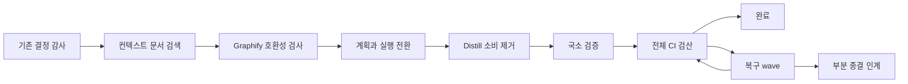

# 컨텍스트 런타임 재구성

## Intent
- 문제: Project Distill이 context 문서와 결정을 중복 저장하고 공통 구조 토큰으로 context graph 탐색을 확산시킨다. 현재 검색은 자연어 요구를 문서 후보로 좁히지 못하고 coordinator의 전체 CI 실패 복구도 종단 상태로 표현하지 못한다.
- 목표: `.bouncer/context/`를 유일한 설계·결정 정본으로 두고, 버전이 고정된 Graphify 산출물에서 근거가 있는 문서 후보를 찾으며, task별 국소 검증과 종단 CI 복구를 감사 가능한 DAG로 실행한다.

## Success criteria
1. 새 프로젝트 init과 모든 runtime workflow가 Distill 파일·명령·승격 ACQ 없이 동작한다.
2. 허용한 역사 문서를 제외한 활성 코드·설정·문서·fixture에서 Distill 계약이 사라진다.
3. Q1–Q3의 기대 문서가 상위 8개에 들고 `Recall@8 >= 0.9`, `MRR >= 0.7`을 만족한다.
4. 정상 질의의 반환 후보 중앙값이 3–8개이며 각 후보가 경로·역할·점수·근거를 제공한다.
5. Q4는 `low-confidence: broad query`, Q5는 `zero-hit`과 구체화 안내를 반환한다.
6. 질의 경로는 lock·manifest·binary 호환성만 검사하며 설치 상태를 변경하지 않는다.
7. graph build metadata와 version lock으로 검색 결과를 재현할 수 있다.
8. 각 구현 task는 변경한 테스트와 직접 관련된 기존 테스트만 검증한다.
9. 새 계획은 모든 integrated leaf 뒤에서 전체 CI를 한 번 실행하고 source commit을 만들지 않는 verification-only 종단 노드를 작성할 수 있다. 이 node 형식을 도입하는 현재 blueprint는 마지막 일반 task에서 전체 CI를 한 번 실행한다.
10. CI 복구는 최대 두 wave와 append-only coordinator 결정 로그를 남긴다.
11. 잔여 실패는 일반 `closed`가 아닌 사용자 확인을 거친 `partial_closed`로 기록되고 integration worktree에 untracked `NEXT_PLAN.md`를 남긴다.
12. 저장소 전체 `npm run ci`가 통과한다.

## Out of scope
- 완료된 context 문서와 Git 이력을 소급 수정하거나 삭제하는 작업
- Graphify 외부 package의 graph schema·질의 엔진 수정과 공식 API 필요성이 입증되지 않은 Python query adapter
- 검색·graph sync·SessionStart 중 pip·network·venv 변경
- Graphify 후보를 `affected_paths`로 자동 승격하는 동작
- cross-blueprint DAG, remote worker scheduler, main-worktree source mutation

## Blueprints
* [Distill 제거·컨텍스트 검색·CI 복구 전환](blueprints/001-distill-removal-context-search-ci-recovery/index.md) - Distill 런타임을 제거하고 역할 기반 context 검색과 제한된 coordinator CI 복구 계약을 코드·workflow·테스트에 연결한다.
