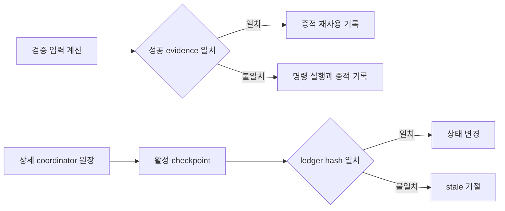

# 검증 재사용과 coordinator checkpoint 도입

Epic: [076](../../index.md)

## Intent

동일 입력의 성공 검증만 내용 주소로 재사용하고 coordinator의 활성 응답은 완료 task summary와 상세 원장 참조로 제한함. 원장 hash가 달라진 stale checkpoint는 어떤 상태 변경도 허용하지 않음.

## Contract

- 인터페이스: `runVerification`은 `task | wave | terminal` scope를 받아 성공 evidence identity를 계산하고, 반환값에 `evidenceId`, `reused`, 선택적 `reusedFrom`을 제공한다. `bouncer coordinate status`는 전체 `tasks`·`decisions` 대신 active checkpoint와 `{ path, sha256, revision }` ledger 참조를 반환하며, 상태 변경 명령은 직전 `ledger_path`와 `ledger_hash`를 함께 받아야 한다.
- 검증 정체성: evidence ID는 Git HEAD, dirty path의 status·content digest, 실제 command, 저장소 기준 POSIX cwd, platform·arch·Node 버전·verify policy config hash, `{ kind, key }` scope의 canonical JSON SHA-256이다. `exit_code: 0`인 완전한 원장 레코드만 hit가 될 수 있다.
- 검증 범위: `task` key는 stable Task ID, `wave` key는 ledger revision과 ready-wave task ID 집합, `terminal` key는 Blueprint stable ID와 integration HEAD다. kind 또는 key가 다르면 같은 SHA와 command여도 miss다. 이번 Blueprint는 세 scope를 runner 계약과 증적 회귀로 고정하며 새로운 wave scheduler는 만들지 않는다.
- 검증 증적: `verification.md`와 Git common directory 원장은 evidence ID, identity 구성 값, `reused`, 선택적 `reused_from`, 원본 실행 시각과 output hash를 함께 가진다. 재사용도 하네스가 현재 문서·원장을 다시 기록하며 G13은 전체 필드를 대조한다.
- checkpoint: 완료 task는 ID, 최종 상태, 마지막 attempt, commit SHA, changed paths, scope revision, verify/review evidence ID와 남은 advisory만 노출한다. ready/open task, unresolved decision, 최근 failure와 fan-in에 필요한 revision은 active 항목으로 노출하고 상세 decision/report 본문은 `.bouncer/runtime/coordinator.json`에만 남긴다.
- hash fence: status가 반환한 integration-relative 상세 원장 경로와 byte SHA-256을 이후 mutation의 `ledger_path`·`ledger_hash`로 사용한다. 경로가 정확한 integration ledger와 다르거나 현재 byte hash가 다르면 쓰기 전에 거절한다.
- 보존 계약: 상세 원장, 두 repair wave, partial-close evidence, dispatch attempt·brief hash, integration/worker branch와 commit provenance는 삭제하거나 축약하지 않는다. legacy ledger는 status에서 checkpoint를 계산할 수 있지만 새 mutation은 status로 받은 hash가 필요하다.
- 수용 기준: Epic 성공 조건 1–8을 모두 만족한다.
- 검증 명령: 계획 승인 시 사용자가 선택한 단일 argv 명령을 각 구현 task와 terminal verification node에 기록한다.
- 실패 모드·엣지 케이스: non-Git checkout, dirty 파일 읽기 실패, config hash 실패, 손상·유실된 verify record, 실패·signal 종료 결과, linked worktree, stale ledger hash, 미해결 decision이나 terminal failure가 있는 task의 조기 요약을 fail-closed로 처리한다.

## Out of scope

- 실패 결과, 다른 scope 또는 다른 environment의 검증 재사용
- 원격 cache와 기존 원장 migration
- 완료 task 상세 기록 삭제 또는 coordinator 원장 파일 교체
- P3 병렬 실행과 P4 finalize digest
- 새로운 coordinator wave scheduler와 wave 상태 전이

## One-commit justification

- Blueprint는 한 PR 단위이며 세 개의 reviewable task commit으로 나눈다. 검증 identity·G13, coordinator checkpoint·hash fence, workflow payload 전환은 순서대로 통합되어 각 단계의 회귀를 독립 검토할 수 있다.

## Documents

* [Task 001](tasks/001/tasks.md) - 검증 evidence identity와 안전한 성공 결과 재사용
* [Task 002](tasks/002/tasks.md) - coordinator checkpoint와 ledger hash fence
* [Task 003](tasks/003/tasks.md) - coordinator workflow의 compact payload 전환
* [Task 004](tasks/004/tasks.md) - 통합 HEAD의 전체 CI 종단 검증
* [Context review](context-review.md) - 계획 문서 정합성 판정
