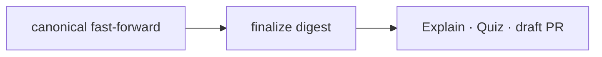

# 002 Finalize digest 기반 Explain·PR 입력

Epic: [078](../../index.md)

## Intent
finalize가 Explain·Quiz·PR에 필요한 입력을 읽기 전용 CLI digest 하나로 받게 해 agent가 원장·task 원문·검증 로그를 다시 모으지 않게 한다.
Explain task 제목에 stable Task ID와 통합 commit SHA를 남기고, 열 수 있는 Explain 링크만 PR에 싣는다.

## Flow

## Contract
- 인터페이스:
  - `bouncer finalize prepare --blueprint <dir>` — 읽기 전용이다. `finalize --yes` 전, task 문서가 남아 있을 때만 성공한다.
  - `bouncer finalize links --blueprint <dir>` — 읽기 전용이다. branch를 원장 `integrationBranch` 또는 현재 checkout에서 스스로 정하고, push된 head 기준 Explain URL 후보만 반환하며 task 문서가 없어도 동작한다.
  - digest의 `pr` 필드: 제목 접두 `[YYMMDD] (→ Target) [Type]`, 결정적으로 채울 수 있는 본문 절, base·head.
  - Explain `## Tasks` 제목: `` ### EPIC-xxx/BP-xxx/TASK-xxx · `sha8` `` (SHA를 모르면 ID만).
- 데이터·상태: 새 파일·원장 필드를 쓰지 않는다. `task_commits` 행 형식(`{ task, sha, intent_anchor }`)은 유지한다. task commit SHA는 finalize checkout의 `base..HEAD`에서 `Bouncer-Task` trailer로 찾고, 없을 때만 tasks.md `commit_sha`를 쓴다.
- 수용 기준: epic Success criteria 8–11.
- 검증 명령: commit task는 `npm test`, 종단 TASKS-005는 `npm run ci`.
- 실패 모드·엣지 케이스:
  - `--yes` 뒤라 task 문서가 없으면 `prepare`는 `task-documents-missing`을 반환한다.
  - remote가 없거나, GitHub가 아니거나, head가 `refs/remotes/origin/<branch>`에 포함되지 않으면 `links`는 URL 없이 이유 코드만 반환한다.
  - drive에서 worker SHA와 통합 SHA가 다르면 digest와 Explain 제목은 통합 SHA를 쓴다.
  - 깨진 원장은 기존 finalize와 같은 `coordinator-ledger` 거절이다.
  - 기존 `### Task NNN` Explain은 intent가 계속 해석한다.

## Out of scope
- `finalize --yes`의 staging·commit·잠금·transient 삭제 순서 변경.
- Quiz 채점, `bouncer.comprehension`, G16 판정 변경.
- 과거 Explain의 제목 일괄 변환, `task_commits` 행 형식 변경.
- `gh pr create`·push 자동 실행(사용자 동의 절차 유지).

## One-commit justification
- 한 PR로 리뷰하되 task별 commit 네 개로 나눈다. digest → (PR 초안·링크 ‖ Explain 제목) → skill 전환 순서다.

## Documents
* [Task 001](tasks/001/tasks.md) - `finalize prepare` digest
* [Task 002](tasks/002/tasks.md) - PR 초안과 Explain 링크 후보
* [Task 003](tasks/003/tasks.md) - stable ID Explain 제목과 intent 호환
* [Task 004](tasks/004/tasks.md) - finalize skill digest 입력 전환
* [Task 005](tasks/005/tasks.md) - 종단 `npm run ci`
* [Context review](context-review.md) - 계획 문서 정합성 판정
