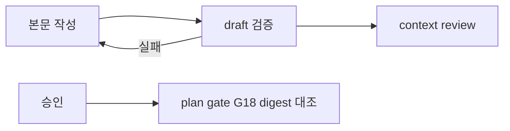

# 계획 draft 검증과 context review 신선도 판정 추가

Epic: [078](../../index.md)

## Intent
- verification task 전용 본문과 review-dispatch plan의 draft 검증으로 G19·G20·Touch 정합성 오류를 context review 전에 거른다.
- plan gate G18이 마지막 리뷰 round의 digest를 현재 계획 본문과 대조해 리뷰 뒤 바뀐 계획을 stale로 거절한다.

## Flow

## Contract
- 인터페이스:
  - `bouncer scaffold task --execution-kind verification`은 verification 전용 `tasks.md` 본문을 쓴다. Touch는 고정 문구 `Source 변경 경로 없음.` 한 줄이다.
  - G20 Touch 실패 메시지: `verification task Touch must not declare source changes: <후보, 쉼표 구분>`.
  - `bouncer review-dispatch plan`은 structural 실패면 기존 `error: 'structural validation failed'`, draft 검사 실패면 `error: 'plan draft validation failed'`와 `failures[]`를 `ok: false`로 반환한다. CLI 인자와 성공 payload는 바뀌지 않는다.
  - G18 stale 메시지: `context review is stale: last round digest <기록값> != current <현재값>; rerun context review`.
- 데이터·상태:
  - draft 검사 = plan gate에서 status를 보지 않는 task 검사(G5·G10·G11·G12·G19·G20). G1·G2·G3·G18은 포함하지 않는다.
  - 계획 snapshot digest(epic `index.md`, blueprint `index.md`, task 번호순 `tasks.md` 본문의 sha256)는 review-dispatch와 G18이 한 모듈의 계산을 공유한다. frontmatter는 digest에 들어가지 않는다.
  - G18 digest 대조 조건: full blueprint, context-review `rounds`가 비어 있지 않음, 모든 task status가 `draft` 또는 `ready`.
- 수용 기준: epic Success criteria 1–7.
- 검증 명령: `npm run ci` (TASKS-005 verification node).
- 실패 모드·엣지 케이스:
  - coordinator repair가 task 문서를 추가하면 digest가 바뀐다. 이때 task는 이미 `ready`를 넘었으므로 대조하지 않아 drive 중 `current --set`이 막히지 않는다.
  - scope revision은 frontmatter만 고치므로 digest에 영향이 없다.
  - snapshot 계산 실패(문서 부재·파싱 실패)는 G18 실패로 닫는다.
  - 마지막 round는 `round` 값이 가장 큰 항목이다.
  - `rounds`가 없는 기존 문서와 light blueprint는 이전 판정을 유지한다.
- stale 복구: controller가 `context-review.md`의 `rounds[]`·`findings[]`를 새 digest 기준 round 1 discovery로 교체하고 status를 `pending`으로 되돌린 뒤 `/bouncer-plan` step 5 리뷰와 step 6 재승인을 다시 거친다. rounds 순서 계약(`discovery` 또는 `discovery → delta`)은 바꾸지 않는다.

## Out of scope
- 새 `validate --gate` 값, CLI 버전 preflight, `extractPathCandidates` 규칙 변경, G14 계약 변경.

## One-commit justification
- 세 변경은 같은 사고의 재발 방지이고 하나의 PR에서 리뷰한다. TASKS-001–003은 `validate-gates.ts`를 순서대로 고치고, TASKS-004는 그 결과 계약을 문서에 옮기므로 넷을 직렬로 둔다.

## Documents
* [Tasks 001](tasks/001/tasks.md) - verification 전용 본문과 G20 후보 표시
* [Tasks 002](tasks/002/tasks.md) - 계획 snapshot 모듈 분리와 review-dispatch draft 검증
* [Tasks 003](tasks/003/tasks.md) - G18 digest 대조
* [Tasks 004](tasks/004/tasks.md) - 규칙·참조 문서 갱신
* [Tasks 005](tasks/005/tasks.md) - 종단 CI 검증
* [Context review](context-review.md) - 계획 문서 정합성 판정
