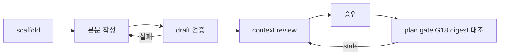

# 계획 리뷰 반복 루프 차단

## Intent
- 문제: Epic 076 계획에서 verification task Touch의 백틱 명령이 G20 경로 후보로 잡혔다. 그 오류를 context review 뒤에야 발견해, 문서를 고칠 때마다 frozen digest가 바뀌고 리뷰를 처음부터 다시 돌렸다.
- 목표: G19·G20·Touch 정합성은 리뷰 snapshot을 얼리기 전에 걸러지고, 리뷰 뒤 계획 본문이 바뀌면 plan gate가 그 리뷰를 stale로 거절한다.

## Success criteria
1. `bouncer scaffold task --execution-kind verification`이 만든 `tasks.md`의 Touch 절에 백틱이 없고, 그 문서의 Touch로는 G20이 나오지 않는다.
2. verification task Touch에 백틱 명령이 있으면 G20 메시지에 경로로 잡힌 후보 토큰(예: `npm run ci`)이 함께 나온다.
3. draft 상태 blueprint에 G5·G10–G12·G19·G20 위반이 있으면 `bouncer review-dispatch plan`이 `ok: false`와 그 코드를 담은 failures를 반환하고, 위반이 없으면 기존과 같은 strategy를 반환한다.
4. context review round 기록 뒤 tasks 본문을 고치면 plan gate가 G18 stale 실패를 낸다. frontmatter만 바뀐 경우(승인 status 전이 등)는 통과한다.
5. task 하나라도 `ready`를 넘어 진행한 blueprint, `rounds`가 없는 context-review 문서, light blueprint는 digest 대조를 받지 않는다.
6. `rules/gates.md`에 (a) 같은 G/S 코드가 수정 뒤 재발하면 다음 수정 전에 validator와 회귀 테스트를 확인한다는 규범과 (b) G18 stale 복구 절차(context review를 새 digest의 round 1로 다시 시작하고 재승인)가 있고, `test/master-rules.test.js`가 두 문구를 단언한다.
7. `npm run ci`가 통과한다.

## Out of scope
- plan preflight의 CLI·plugin 버전 불일치 검사 (현재 설치 CLI가 `review-dispatch`를 지원한다).
- `extractPathCandidates`의 추출 규칙 변경. G11·G12가 같은 함수를 공유한다.
- 새 `bouncer validate --gate` 값 추가.
- execute 리뷰(G14)의 rounds·digest 계약.
- Epic 075(review dispatch)·076(verification node) blueprint 재개. 두 epic의 후속 보강을 이 epic이 새로 담는다.

## Blueprints
* [001 draft 검증과 리뷰 신선도](blueprints/001-draft-validation-review-freshness/index.md) - verification 전용 템플릿·G20 후보 표시, review-dispatch plan draft 검증, G18 digest 대조를 validate·scaffold·review-dispatch와 규칙 문서에 넣는다
