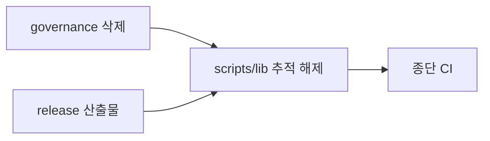

# 001 릴리스 산출물 전환과 governance 규칙 삭제

Epic: [079](../../index.md)

## Intent
- 설치본이 `release` 브랜치의 빌드 산출물을 받게 한 뒤 개발 브랜치에서 생성 CommonJS 추적을 끊어 코드 탐색 중복을 없앰.
- 정본을 모두 옮긴 `rules/governance.md`의 남은 구현 설명을 구현 코드 주석으로 옮기고 파일과 참조를 삭제함.

## Contract
- 인터페이스:
  - `node scripts/build-release.js --out <dir>`: `npm run build` 뒤 `npm pack --dry-run --json` 파일 목록을 `<dir>`에 복사한다. `<dir>`가 비어 있지 않거나 build·pack이 실패하면 아무것도 쓰지 않고 1로 끝난다.
  - `.github/workflows/release.yml`: `bouncer--v*` 태그 push 또는 기본 브랜치(`develop`)의 `workflow_dispatch` 수동 실행에서 위 스크립트를 실행하고 산출 트리를 `release` 브랜치에 commit·push한다. 수동 실행은 병합 직후 버전 bump·태그 없이 첫 `release`를 만드는 경로다.
  - `scripts/bouncer`: `scripts/lib/cli.js`가 없으면 `npm run build` 안내를 stderr에 쓰고 1로 끝난다.
  - `npm run check:emit`: 빌드 성공과 `git ls-files -- scripts/lib` 빈 출력을 요구한다.
- 데이터·상태: `scripts/lib/**`는 `develop`에서 untracked·ignored 생성물이 되고 `release` 브랜치에만 commit된다. `rules/governance.md`는 삭제되고 ownership map의 BP4 행 current owner가 `scripts/src/lib/*.ts`로 바뀐다.
- 수용 기준: epic Success criteria 1–9.
- 검증 명령: `npm run ci` (TASKS-004 종단 검증).
- 실패 모드·엣지 케이스:
  - 빌드 전 fresh clone·local-path 설치에서 launcher와 hook이 `scripts/lib`를 찾지 못함 → launcher는 안내 후 1, 문서는 `npm run build` 선행을 명시.
  - 기본 브랜치 URL로 등록한 원격 marketplace 설치는 병합 뒤 `scripts/lib` 없는 트리를 받아 hook이 실패함 → `docs/install.md`가 이 경로를 더 이상 지원하지 않는다고 적고 `git clone -b release` 뒤 로컬 경로 설치로 안내한다(TASKS-002 테스트 (f)).
  - `npm pack` 목록이 루트 `.gitignore` 때문에 `scripts/lib`를 빼는 경우 → `files` 필드가 루트 ignore보다 우선한다는 전제를 테스트로 고정한다.
  - `release` 브랜치가 아직 없을 때 workflow는 orphan 브랜치로 처음 만든다.
  - GitHub는 기본 브랜치에 있는 workflow 파일만 `workflow_dispatch`로 실행하므로 병합 전에는 수동 실행할 수 없다. 병합과 첫 수동 실행 사이 설치 공백은 운영 절차로 줄인다.
  - 기본 브랜치가 아닌 ref에서 수동 실행하면 job이 건너뛰어져 `release`를 바꾸지 않는다.
  - 태그 commit에서 `npm run ci`가 실패하면 release commit을 만들지 않는다.
  - `rules/governance.md` 삭제 뒤 ownership digest 검사가 없는 파일을 읽어 실패하는 경우 → digest 메타데이터와 검사를 삭제 사실 검사로 바꾼다.

## Out of scope
- epic Out of scope 전부.
- `docs/configuration.md`의 `graphify.exclude_dirs` 예시(`scripts/lib`)는 생성 경로 예시로 유지한다.

## One-commit justification
- 한 PR 안에서 task별 commit 3개와 종단 검증 1개로 나눈다. governance 삭제(TASKS-001)와 release 산출물(TASKS-002)은 경로가 겹치지 않아 병렬이고, 추적 해제(TASKS-003)는 release 경로가 준비된 뒤에만 안전하므로 두 task에 의존한다.

## Documents
* [Tasks 001](tasks/001/tasks.md) - governance 구현 설명 이전과 삭제
* [Tasks 002](tasks/002/tasks.md) - release 산출물 스크립트와 workflow
* [Tasks 003](tasks/003/tasks.md) - `scripts/lib` 추적 해제
* [Tasks 004](tasks/004/tasks.md) - 종단 CI 검증
* [Context review](context-review.md) - 계획 문서 정합성 판정
