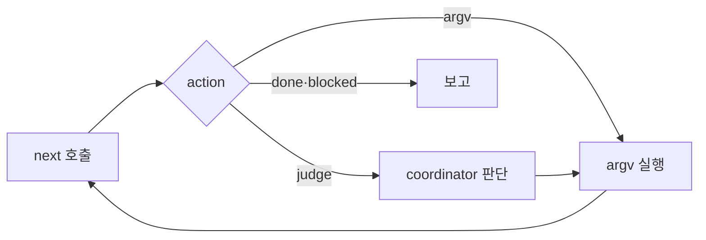

# coordinator 다음 행동 CLI

Epic: [088](../../index.md)

## Intent
coordinator가 원장과 worker 문서를 읽어 다음 행동을 스스로 계산하던 일을 읽기 전용 `coordinate next`가 맡음. coordinator는 돌려받은 `argv`를 실행하고 `judge` 항목만 판단함.

## Contract
- 인터페이스
  - `bouncer coordinate next --blueprint <dir> [--task <NNN>] [--repo <dir>]`. `coordinate status`처럼 integration worktree에서 실행하고 fence 플래그를 받지 않는다. 응답의 `cwd`가 `argv`를 실행할 자리다(integration 또는 그 task의 worker). 결정이 나오면 stdout JSON `ok: true`, exit 0. 원장 읽기 실패·잘못된 task는 `ok: false`와 `reason`·`cause`·`next`, exit 1. 플래그 오류는 usage와 exit 2.
  - `--help`는 플래그, 두 범위의 action 값, 응답 필드를 출력한다.
  - 응답 모양:

    ```ts
    type NextResult = {
      ok: true; scope: 'blueprint' | 'task'; action: NextAction; task?: string;
      cwd: string;                 // argv를 실행할 절대 경로
      argv?: string[];             // fence·lease·attempt·hash를 채운 실행 명령
      judge?: { kind: JudgeKind; fields: string[]; allowed?: string[] };
      task_ids?: string[];         // drive_tasks의 대상 task id
      payload?: Record<string, unknown>; // implement의 dispatch metadata
      reason?: string; cause?: string; next?: string; // blocked·none일 때
      checkpoint: { ledger: { path: string; sha256: string; revision: string | null } };
    };
    ```

  - blueprint 범위 action(`--task` 없음): `prepare`, `drive_tasks`, `integrate`, `verification_node`, `final_review`, `done`, `blocked`.
  - task 범위 action(`--task NNN`): `dispatch`, `implement`, `verify`, `review`, `commit`, `report`, `record`, `revise`, `none`, `blocked`.
  - `judge.kind`: `intent-symbols`(dispatch 전 `intent bundle`의 `--symbol`), `report-outcome`(outcome·summary), `record-decision`(실제 변경 경로를 적은 decision), `scope-revision`(`--paths`·`--reason`), `review-round`(perspective 순회와 round 기록).
- 데이터·상태
  - 원장 스키마, reason 집합, 기존 `coordinate` mutation의 동작과 출력은 바뀌지 않는다.
  - task 안 단계는 새 상태를 저장하지 않고 다음 근거에서 판정한다. 원장 `dispatch`(status, outcome, attempt, task_brief_hash, base_head, initial_worktree_state), worker의 `tasks.md`(`bouncer.status`, `bouncer.commit_sha`), `verification.md` `bouncer.status`, task `review.md` 또는 blueprint 루트 `review.md`의 `bouncer.status`, worker HEAD와 porcelain.
  - 판정 순서(task 범위, commit task, 원장 `prepared`): 활성 critical recovery → dispatch 없음·비수락 보고 → 활성 dispatch 안의 implement → verify → review(per-task 모드) → commit → report → record.
  - commit 완료는 `tasks.md` `bouncer.commit_sha`가 worker HEAD 앞 8자와 같은 상태다. `bouncer commit`이 commit 뒤 그 `tasks.md`에 SHA를 쓰므로, 그 파일 하나만 바뀐 worktree는 정상이다.
  - per-task 리뷰의 frozen target은 base `git merge-base <원장 integrationHead> <worker HEAD>`, head worker HEAD다. `next`가 두 값을 계산해 `argv`에 넣는다.
  - 성공 응답은 기존 `compactCoordinateOutput`을 거치므로 최상위 `tasks`·`decisions` 키를 쓰지 않는다.
- 수용 기준: epic Success criteria 6~9.
- 검증 명령: 각 task `bouncer.verify`. 머지 전 `npm run ci`는 PR CI가 실행한다.
- 실패 모드·엣지 케이스
  - 근거끼리 어긋나면 추측하지 않고 `blocked`를 돌려준다. 예: `commit_sha`가 worker HEAD와 다름, commit 뒤 그 task `tasks.md` 밖의 경로가 dirty임, 원장 `recorded`인데 worker HEAD가 원장 `sha`와 다름.
  - `argv`를 실행하기 전에 원장이 바뀌면 기존 fence가 `stale-ledger-checkpoint`로 거절한다. coordinator는 `next`를 다시 부른다.
  - 병렬 wave 일부만 `recorded`이면 `integrate`가 아니라 `drive_tasks`를 돌려준다.
  - repair 한도(`awaiting_confirmation`), `partial_closed`, 종단 검증 실패는 `blocked`를 돌려준다. repair·critical recovery·partial close 실행은 coordinator 판단으로 남는다.
  - 중단된 fan-in(원장 `fanin`이 null이 아님)은 `integrate`로 재개한다. fan-in 충돌은 원장 상태로 남지 않고 `integrate` 응답의 `fanin-conflict`로 오며, coordinator가 Judge에서 판단한다. 그 뒤 `next`는 남은 원장 상태로 판정한다.
  - 원장이 없거나 lease shape가 손상됐으면 `coordinate status`와 같은 reason으로 `ok: false`.
  - `--task`가 verification task이면 `ok: false`, reason `verification-task-uses-blueprint-next`. `blocked`와 `ok: false`의 `cause`·`next`는 기존 reason(`repair-wave-limit` 등)이면 `COORDINATE_FAILURE_HINTS`에서, `next`가 새로 내는 reason이면 `NEXT_FAILURE_HINTS`에서 얻는다. 두 표에 같은 reason을 두지 않는다.



## Out of scope
- 단계별 계약 카드(execute reference 3개 대체)와 과제 크기별 절차(리뷰 라운드 수 축소 등).
- 기존 `coordinate` mutation 서브커맨드, 원장 스키마, 실패 hint 문구 변경.
- `skills/bouncer-run/SKILL.md`의 root 세션 절차, plan 승인 추론, open decisions의 ACQ 전환, print dispatch의 context-reviewer 지원.
- 벤치마크 하네스와 재측정 실행.

## One-commit justification
- PR 하나로 리뷰하는 2단계 첫 묶음이고 task마다 한 커밋이 된다. TASKS-001이 CLI를 만들고 TASKS-002가 그 응답을 기준으로 coordinator 지침을 바꾸므로 `depends_on`이 001 → 002 순서를 고정한다. 지침만 바뀌거나 CLI만 들어가면 coordinator가 쓸 수 없는 상태가 된다.

## Documents
* [Tasks 001 — coordinate next](tasks/001/tasks.md) - 읽기 전용 행동 판정, 서브커맨드·도움말, fixture 주행 테스트
* [Tasks 002 — coordinator 지침의 next 루프](tasks/002/tasks.md) - Procedure 재작성, commit 단계 명시, TOML 동기화
* [Verification](tasks/001/verification.md) - 검증 명령과 증적
* [Review](review.md) - 리뷰 발견사항
* [Context review](context-review.md) - 계획 문서 정합성 판정
