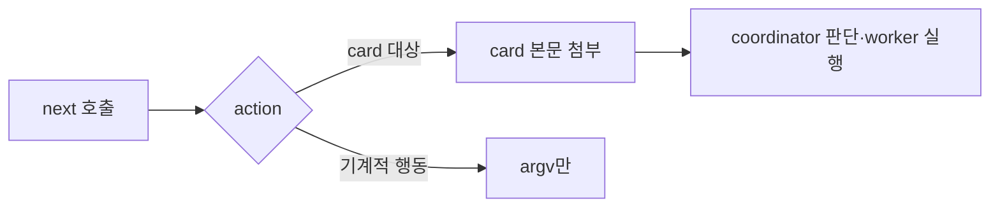

# coordinator 계약 카드

Epic: [088](../../index.md)

## Intent
coordinator가 drive 세부 규칙을 얻으려고 execute reference 세 개와 긴 역할 문서를 읽던 일을, `coordinate next`가 행동별 계약 카드를 함께 돌려주는 방식으로 바꿈. coordinator 지침에는 Authority·Hard guards·`next` 루프·Output contract와 Worker dispatch·Task round의 짧은 안내만 남김.

## Contract
- 인터페이스
  - 카드 파일 `references/coordinator-cards/<card>.md` 9개: `dispatch`, `implement`, `verify`, `review`, `report`, `revise`, `record`, `final_review`, `blocked`. 각 카드는 그 행동에서 coordinator가 지킬 drive 전용 규칙만 담는 Markdown이다. 길이 제한은 없다.
  - `coordinate next` 응답(`NextResult`)에 선택 필드 하나가 더해진다.

    ```ts
    type NextResult = /* 088-002 필드 그대로 */ & {
      card?: { id: CardId; body: string };  // 카드 파일 본문 그대로
    };
    type CardId = 'dispatch' | 'implement' | 'verify' | 'review' | 'report'
      | 'revise' | 'record' | 'final_review' | 'blocked';
    ```

  - `card` 첨부 규칙: action이 `dispatch`·`implement`·`verify`·`review`·`report`·`revise`·`record`·`final_review`·`blocked`이면 같은 id의 카드를 싣는다. `prepare`·`drive_tasks`·`integrate`·`verification_node`·`commit`·`done`·`none`과 `ok: false`에는 `card` 키가 없다.
  - `coordinate next --help`는 `card` 필드와 첨부 규칙을 한 줄로 알린다.
  - `agents/bouncer-coordinator.md`는 Authority, Hard guards, `next` 루프 Procedure, Output contract를 유지한다. Worker dispatch와 Task round의 drive 세부 규칙은 카드로 옮기고, 세 execute reference를 가리키거나 읽으라는 문장은 없앤다.
- 데이터·상태: 원장, `next` 판정 규칙, 기존 응답 필드, worker 역할 문서와 worker payload는 바뀌지 않는다.
- 수용 기준: epic Success criteria 6, 10~12.
- 검증 명령: 각 task `bouncer.verify`. 머지 전 `npm run ci`는 PR CI가 실행한다.
- 실패 모드·엣지 케이스
  - 첨부 대상 action의 카드 파일이 없거나 읽을 수 없으면 `ok: false`, reason `coordinator-card-missing`, exit 1. `cause`·`next`는 `NEXT_FAILURE_HINTS`에서 얻는다.
  - 카드 경로는 실행 중인 플러그인 루트 기준이다. 소비 저장소의 `references/`나 cwd에서 찾지 않는다.
  - named agent fallback·print dispatch로 띄운 coordinator도 같은 `next` 출력으로 카드를 받는다.
  - standalone `/bouncer-execute`와 세 reference는 그대로라, 양쪽에 걸리는 규칙은 테스트가 같은 문구를 확인한다.



## Out of scope
- 세 execute reference와 `skills/bouncer-execute/SKILL.md` 수정.
- 과제 크기별 절차, `next` 판정 규칙 변경.
- worker 역할 문서(`agents/bouncer-{implementer,reviewer,debugger}.md`)와 worker payload.
- 벤치마크 하네스와 재측정.

## One-commit justification
- PR 하나로 리뷰하는 2단계 두 번째 묶음이고 task마다 한 커밋이 된다. TASKS-001이 카드와 `card` 첨부를 만들고 TASKS-002가 그 카드를 전제로 coordinator 지침에서 같은 규칙을 걷어내므로 `depends_on`이 001 → 002 순서를 고정한다. 지침만 먼저 줄면 coordinator가 규칙을 받을 곳이 없다.

## Documents
* [Tasks 001 — 계약 카드와 card 첨부](tasks/001/tasks.md) - 카드 9개, `coordinate-next.ts` 첨부, 테스트
* [Tasks 002 — coordinator 지침 축소](tasks/002/tasks.md) - Worker dispatch·Task round 이전, reference 문장 제거, TOML
* [Verification 001](tasks/001/verification.md) - 검증 명령과 증적
* [Verification 002](tasks/002/verification.md) - 검증 명령과 증적
* [Review](review.md) - 리뷰 발견사항
* [Context review](context-review.md) - 계획 문서 정합성 판정
