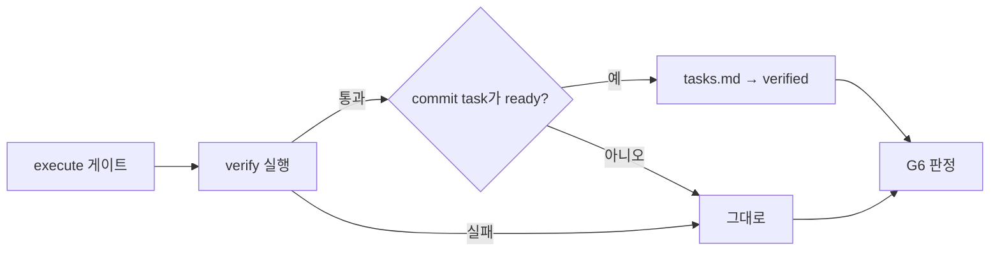

# coordinator 지침 탐색 제거

Epic: [088](../../index.md)

## Intent
1.5.5 재측정(ledger-004 두 번)에서 coordinator는 도구 호출 57~65회 중 22~33회를 플러그인 지침·소스 탐색에 썼다. 원인은 세 곳이다. `tasks → verified`를 어떻게 바꾸는지 몰라 `validate-gates.ts`까지 읽었고, print dispatch `--input` 형식을 몰라 `print-dispatch.ts`·역할 문서를 읽었고, blueprint 리뷰 round JSON의 `task_brief_hashes`·`intent_bundles` 형식을 몰라 `review-record.js`를 읽었다. 이 blueprint는 상태 전환을 CLI가 맡게 하고, 나머지 두 형식을 카드와 `--help`에 둬서 그 탐색을 없앤다. 목표치(판정 기준 아님)는 ledger-004에서 coordinator의 플러그인 탐색 호출 5회 이하다.

## Contract
- 인터페이스
  - execute 게이트(`bouncer validate --gate execute`)와 `bouncer verify`는 verify 명령이 통과하면 lease·pointer가 가리키는 commit task의 `tasks.md` `bouncer.status`를 `ready`에서 `verified`로 바꾼다. 다른 출력·종료 코드는 그대로다.
  - `references/coordinator-cards/verify.md`는 `next`의 `argv`(execute 게이트)를 실행하면 상태 전환까지 끝난다고 적고, 상태를 손으로 바꾸라는 문장이 없다. `skills/bouncer-execute/SKILL.md`도 같다.
  - `references/coordinator-cards/{implement,review,final_review}.md`는 print dispatch `--input` 텍스트 템플릿(항목과 순서)을 싣고, `bouncer dispatch print`가 역할 본문을 앞에 붙이므로 `agents/*.md`·reviewer prompt 문서를 읽지 않는다고 적는다.
  - `bouncer review record --help`는 blueprint 리뷰 모드 round 예시에 `task_brief_hashes`와 `intent_bundles`를 보여준다.
- 데이터·상태: 원장, `coordinate next` 판정 규칙과 응답 필드, worker 역할 문서는 바뀌지 않는다. 상태 전환은 `.bouncer/` 안의 frontmatter라 `source_digest`와 `task_brief_hash`에 들어가지 않는다.
- 수용 기준: epic Success criteria 6, 13~16.
- 검증 명령: 각 task `bouncer.verify`. 머지 전 `npm run ci`는 PR CI가 실행한다.
- 실패 모드·엣지 케이스
  - verify 명령이 실패하면 상태를 바꾸지 않는다.
  - 이미 `verified`이거나 `ready`가 아닌 상태는 그대로 둔다(no-op).
  - lease·pointer가 없거나 다른 blueprint를 가리켜 listing에서 task를 고른 경우는 상태를 바꾸지 않는다.
  - `execution_kind: verification` task와 coordinator가 integration worktree에서 돌리는 terminal verification은 상태를 바꾸지 않는다. verification task의 상태는 `integrated`로 닫히는 기존 흐름이 맡는다.
  - 원장 재사용(cache hit)으로 통과해도 통과로 보고 같은 전환을 한다.
  - `tasks.md`를 읽거나 쓸 수 없으면 verify 결과와 별개로 실패를 알리고, 증적은 그대로 남긴다.

## Out of scope
- `coordinate next`가 완성된 `--input` 텍스트를 돌려주는 방식.
- 시작할 때 읽는 규칙 문서 네 개(`plugin-root.md`, `AGENTS.md`, `cursor-print-dispatch.md`, `subagent-model.md`)의 Read 제거.
- plan 단계 비용, 과제 크기별 절차, 재측정 실행.

## One-commit justification
- PR 하나로 리뷰하는 088 후속 묶음이고 task마다 한 커밋이 된다. TASKS-001은 CLI 상태 전환과 그 문구, TASKS-002는 카드 템플릿과 `--help`를 맡는다. 두 task 모두 CHANGELOG를 고치므로 `depends_on`이 001 → 002 순서를 고정한다.

## Documents
* [Tasks 001 — verify 상태 전환](tasks/001/tasks.md) - `verification.ts`·execute 게이트, verify 카드, execute 스킬, 테스트
* [Tasks 002 — dispatch 입력 템플릿과 리뷰 help](tasks/002/tasks.md) - implement·review·final_review 카드, `review record --help`, 테스트
* [Verification 001](tasks/001/verification.md) - 검증 명령과 증적
* [Verification 002](tasks/002/verification.md) - 검증 명령과 증적
* [Review](review.md) - 리뷰 발견사항
* [Context review](context-review.md) - 계획 문서 정합성 판정
