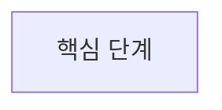

## 관련 이슈

- Explain: [explain.md](<head에서 열리는 URL>)

<!--
Bouncer 사이클이 아니면 Explain 줄을 지운다.
이슈 근거가 없으면 이슈 불릿을 만들지 않는다.
-->

## 배경 · 변경 의도

-

## 주요 변경 내용

-

## 로직 흐름

<!--
호출 순서·제어 흐름·상태 전이·데이터 단계·컴포넌트 책임이 바뀐 경우에만
Mermaid를 넣는다. 문서·설정·테스트만 바뀌거나 단순 이름 변경·이동이면
이 절 제목(## 로직 흐름)까지 삭제한다. 핵심 노드는 약 8개 이하.
-->

## 리뷰 포인트

-

## 확인 방법

-
