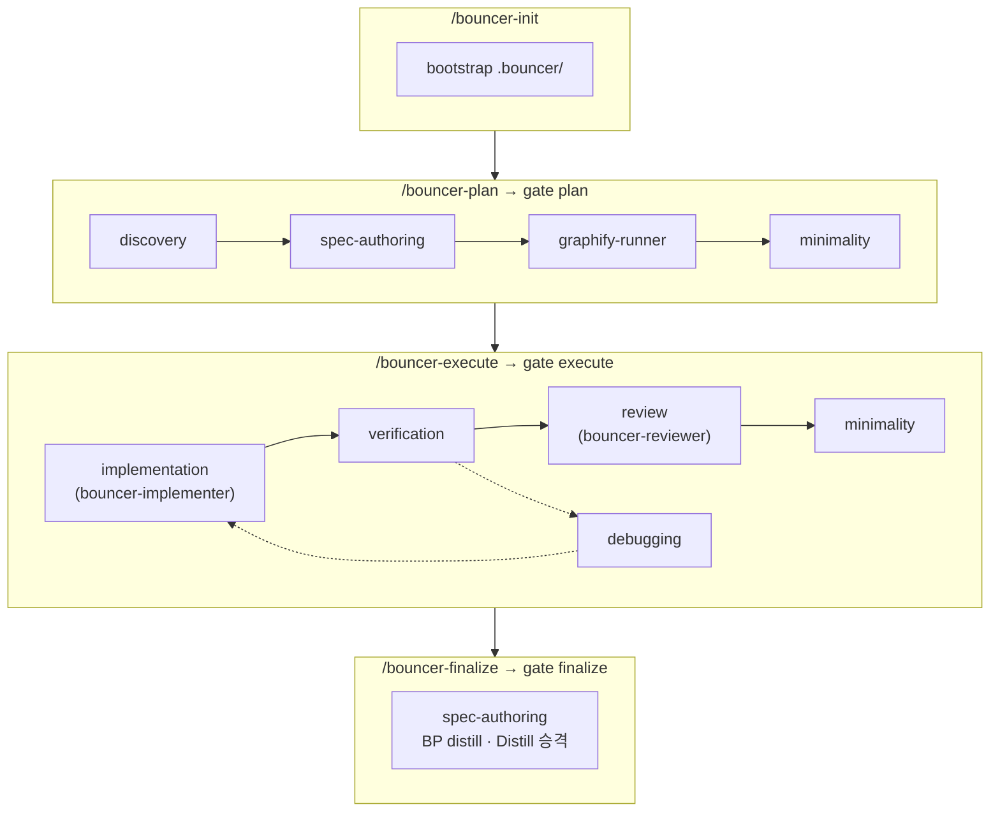

# Bouncer

에이전트가 "다 했습니다"라고 말하기 전에, **실제로 했는지** 검사하는 플러그인.

같은 저장소가 [Claude Code](docs/install.md#claude-code) · [Cursor](docs/install.md#cursor) · [Codex](docs/install.md#codex)에서 설치됩니다.

## Why

코딩 에이전트에게 일을 맡기면 세 가지가 반복됩니다.

- **범위가 번진다.** 인증을 고치라고 했는데 결제 코드까지 손댄다.
- **검증이 말뿐이다.** "테스트 전부 통과"라고 적지만 실행한 적은 없다.
- **커밋이 뒤섞인다.** 한 커밋에 기능·리팩터·포맷팅이 함께 들어와 리뷰가 불가능하다.

Bouncer는 작업을 **하나의 리뷰 가능한 커밋** 단위(blueprint)로 쪼개고, 각 단계를 결정적 게이트로 막습니다.
게이트는 문서 상태와 본문을 검사하는 Node 스크립트라 에이전트가 설득할 대상이 아닙니다.

## Features

- **Blueprint 단위 커밋** — 한 사이클이 리뷰 가능한 한 커밋으로 끝남
- **실제 검증 실행** — execute 게이트가 `tasks.bouncer.verify`(또는 `config.verify` 폴백)를 돌려 증적을 남김
- **변경 범위 가드** — 승인된 `affected_paths` 밖 커밋을 훅이 차단
- **Worktree execute** — plan 산출물을 worktree로 옮긴 뒤 구현·verify·review (`<type>/<BP-id>-…` 브랜치)
- **활성 포인터 CLI** — `bouncer current`로 읽기 / 설정 / 지우기
- **Discovery 심화** — Distill·epic 겹침·엣지/실패 모드까지 확인한 뒤 plan에 인계
- **Project Distill** — plan/execute 전 `.bouncer/context/Distill.md`를 읽고, finalize가 승격
- **Named 서브에이전트** — implementer / reviewer 분리와 모델 설정 계약
- **최소 변경 사다리** — 구현·리뷰가 재사용·과설계를 먼저 점검
- **멀티 에이전트** — Claude Code · Cursor · Codex가 같은 스킬·게이트 계약을 사용
- **증적 있는 finalize** — 코드와 `.bouncer/context` 문서를 한 커밋에 담고, PR·worktree 정리는 확인 후

단계별 스킬 흐름:



게이트·CLI·설정은 [docs/workflow.md](docs/workflow.md)를 참고 바랍니다.

## Requirements

- Node.js 24에서 검증 (런타임은 표준 모듈 + 벤더링된 `js-yaml`)
- Claude Code, Cursor, 또는 Codex
- (선택) `gh` — finalize 시 draft PR 생성

## Install

다른 프로젝트에 스킬·훅이 붙지 않도록 **project 또는 local scope** 설치를 권장합니다.
(`user`/전역은 모든 워크스페이스에 적용됩니다.)

### Claude Code

```
/plugin marketplace add https://github.com/cheongfish/bouncer.git
/plugin install bouncer@chunjae-tools
```

프로젝트 전용 예:

```bash
claude plugin install bouncer@chunjae-tools --scope project   # 팀 공유 (.claude/settings.json)
claude plugin install bouncer@chunjae-tools --scope local     # 본인만 (.claude/settings.local.json)
```

### Cursor

```
/add-plugin https://github.com/cheongfish/bouncer.git
```

설치 UI에서 **project / workspace**를 선택하세요.

### Codex

```bash
codex plugin marketplace add https://github.com/cheongfish/bouncer.git
codex plugin add bouncer@chunjae-tools
```

로컬 경로·환경변수·훅 trust·비공개 저장소 주의사항은 [docs/install.md](docs/install.md)를 참고 바랍니다.

## Quickstart

```
/bouncer-init
```

`.bouncer/`를 만듭니다(전역 `Distill.md` 포함). 기존 파일은 건드리지 않습니다.
`.gitignore` 추가는 **안내만** 하므로 알려주는 항목을 직접 넣으세요.

부트스트랩은 바로 커밋하는것을 추천 드립니다 (`/bouncer-plan` 전에만 가능).
이유는 [docs/context-versioning.md](docs/context-versioning.md) 참고 바랍니다.

```bash
git add .bouncer && git commit -m "chore: bootstrap bouncer"
```

`.bouncer/config.json`에서 `source_dirs`와 **execute 게이트가 실제로 돌릴** `verify`를 프로젝트에 맞게 확인하세요.

```
/bouncer-plan      # epic → blueprint → tasks, affected_paths 승인
/bouncer-execute   # worktree seed → 구현 · verify · review
/bouncer-finalize  # BP distill · 전역 Distill 승격 · 커밋 (+ draft PR)
```

각 단계 끝에서 게이트가 돌고, 실패하면 코드와 파일이 찍힙니다.

## Documentation

전체 목차는 [docs/README.md](docs/README.md)입니다.

| 문서 | 내용 |
| --- | --- |
| [Install](docs/install.md) | 에이전트별 설치 |
| [Workflow](docs/workflow.md) | `/bouncer-*` 단계·게이트 흐름 |
| [Configuration](docs/configuration.md) | `.bouncer/config.json` |
| [Gates](docs/gates.md) | 게이트와 G·S 코드 |
| [Troubleshooting](docs/troubleshooting.md) | 막혔을 때 |
| [Architecture](docs/ARCHITECTURE.md) | 설계 결정 |
| [Contributing](docs/contributing.md) | 개발·커밋·CI |
| [Pilot](docs/PILOT.md) | 파일럿·알려진 마찰 |
| [Changelog](CHANGELOG.md) | 변경 이력 · [0.3.0 요약](CHANGELOG.md#030--2026-08-04) |
