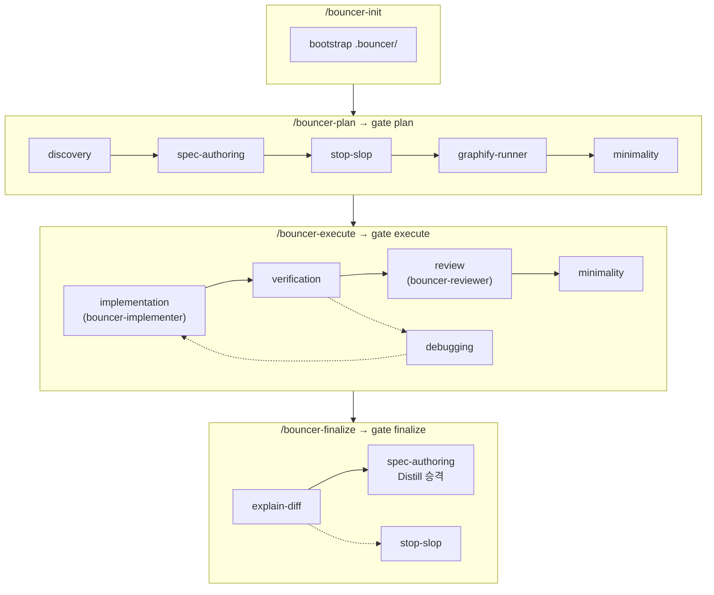

# Bouncer

에이전트가 "다 했습니다"라고 말하기 전에, **실행했는지** 검사하는 플러그인.

같은 저장소가 [Claude Code](docs/install.md#claude-code) · [Cursor](docs/install.md#cursor) · [Codex](docs/install.md#codex)에서 설치됩니다.

## Why

코딩 에이전트에게 일을 맡기면 세 가지가 반복됩니다.

- **범위가 번진다.** 인증을 고치라고 했는데 결제 코드까지 손댄다.
- **검증이 말뿐이다.** "테스트 전부 통과"라고 적지만 실행한 적은 없다.
- **커밋이 뒤섞인다.** 한 커밋에 기능·리팩터·포맷팅이 함께 들어와 리뷰가 불가능하다.

> Bouncer는 작업을 **하나의 리뷰 가능한 커밋** 단위(blueprint)로 쪼개고, 각 단계를 결정적 게이트로 막습니다.
> 게이트는 문서 상태와 본문을 검사하는 Node 스크립트라 에이전트가 설득할 대상이 아닙니다.

## Features

- Blueprint commits
- Verified execute
- Path guard
- Worktree execute

단계별 스킬 흐름:




## Install

다른 프로젝트에 스킬·훅이 붙지 않도록 **project 또는 local scope** 설치를 권장합니다.
자세한 설치·루트 해석은 [docs/install.md](docs/install.md)를 보세요.

### Claude Code

카탈로그는 `.claude-plugin/marketplace.json`입니다. 마켓을 등록한 뒤 플러그인을 설치합니다.

```
/plugin marketplace add https://github.com/cheongfish/bouncer.git
/plugin install bouncer@chunjae-tools
```

프로젝트 전용 예:

```bash
claude plugin install bouncer@chunjae-tools --scope project   # 팀 공유 (.claude/settings.json)
claude plugin install bouncer@chunjae-tools --scope local     # 본인만 (.claude/settings.local.json)
```

### Cursor

단일 플러그인이라 `.cursor-plugin/plugin.json`만 있으면 됩니다 (marketplace 카탈로그 없음).

```
/add-plugin https://github.com/cheongfish/bouncer.git
```

설치 UI에서 **project / workspace**를 선택하세요.

Cursor는 Claude/Codex와 달리 스킬 셸에 플러그인 루트 변수를 넣지 않습니다.
`/bouncer-plan` 등이 `scripts/bouncer`를 찾으려면 **`BOUNCER_HOME`을 설치
디렉터리로 export** 하세요 (`scripts/bouncer`가 있는 곳).

```bash
# 예: 로컬 플러그인 경로 — 실제 설치 위치로 바꾸세요
export BOUNCER_HOME=~/.cursor/plugins/local/bouncer
```

셸 프로필이나 프로젝트 환경에 넣어 두면 세션마다 다시 설정하지 않아도 됩니다.
커밋 가드 훅은 상대 경로라 `BOUNCER_HOME`과 무관합니다.

### Codex

레포 카탈로그는 `.agents/plugins/marketplace.json`입니다.

```bash
codex plugin marketplace add https://github.com/cheongfish/bouncer.git
codex plugin add bouncer@chunjae-tools
```


## Quickstart

```
/bouncer-init
```

`.bouncer/`를 만듭니다(전역 `Distill.md` 포함). 기존 파일은 건드리지 않습니다.
`.gitignore` 추가는 **안내만** 하므로 알려주는 항목을 직접 넣으세요.

부트스트랩은 바로 커밋하세요 (`/bouncer-plan` 전에만 가능).
이유는 [docs/context-versioning.md](docs/context-versioning.md)에 있습니다.

```bash
git add .bouncer && git commit -m "chore: bootstrap bouncer"
```

`.bouncer/config.json`에서 `source_dirs`와 **execute 게이트가 돌릴** `verify`를 프로젝트에 맞게 확인하세요.

```
/bouncer-plan      # epic → blueprint → tasks, affected_paths 승인
/bouncer-execute   # worktree seed → 구현 · verify · review
/bouncer-finalize  # explain-diff · Distill 승격 · 커밋 (+ draft PR)
```

## Requirements

- Node.js 24에서 검증 (런타임은 표준 모듈 + 벤더링된 `js-yaml`)
- Claude Code, Cursor, 또는 Codex
- (선택) `gh`: finalize 시 draft PR 생성

## Documentation

문서 목차는 [docs/README.md](docs/README.md)에 있습니다.

