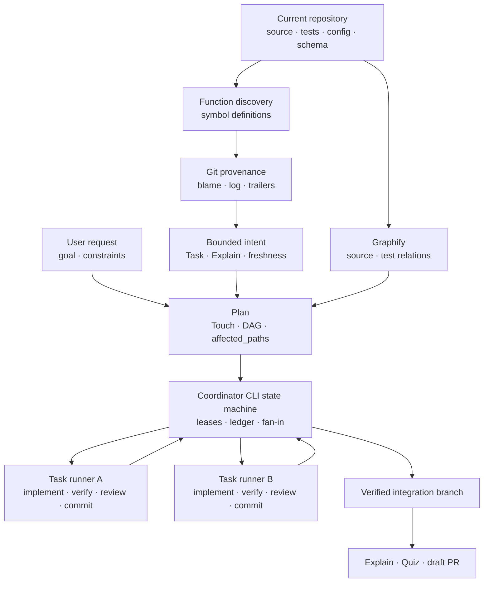

# Bouncer 제품 개선 로드맵

작성일: 2026-09-15  
갱신일: 2026-09-18  
상태: Epic 071·072 완료 · Epic 073 BP-001 완료(PR #124) · 다음 계획 대상 P2.2 규모·위험 기반 review dispatch  
대상: Plan, Run, Commit, Finalize, Graphify, intent provenance

## 1. 목적

Bouncer는 사용자가 승인한 변경 범위, 실제 검증 증적, 리뷰 가능한 커밋을 강제한다.
이 로드맵은 그 안전 경계를 유지하면서 Plan과 실행 과정에서 읽는 문서, 반복하는 판단,
장기 보존 데이터를 줄인다.

다음 제품 기능은 유지한다.

- `/bouncer-run`, coordinator와 task DAG
- `bouncer intent`와 Git 기반 intent provenance
- Explain, Quiz, comprehension과 draft PR 자동화
- source/test Graphify와 범위 추천
- 실제 verification과 `affected_paths` commit guard

자연어 context 검색과 context graph는 제거한다. Plan은 현재 코드에서 관련 함수를 찾고,
Git commit으로 연결된 Task와 Explain만 읽는다. Coordinator는 DAG와 worktree를 유지하되
CLI가 계산할 수 있는 상태 전이와 한도는 프롬프트에서 CLI로 옮긴다.

이 로드맵은 토큰 계측 기능을 만들지 않는다. Usage event, tokenizer telemetry, 단계별
토큰 수집, 토큰 수치를 이용한 승격 조건과 별도 벤치마크는 범위에서 제외한다. 입력
상한은 byte, 항목 수, 문서 절과 hash 같은 결정적 값으로 집행한다.

첫 후속 작업인 스킬 프롬프트 압축은 PR #116으로 마쳤다. 이 작업은 현재 CLI, gate, ACQ,
coordinator, Graphify와 Finalize 동작을 바꾸지 않았다. 이후 BP 003은 PR #117로, BP 004는
PR #118로 병합해 닫았고, BP 005 terminal verification도 PR #119로 마쳤다.

Epic 072(P1)에서는 Graphify compact payload를 PR #120으로, Intent lazy runtime boundary를
PR #121로, retention audit와 migration 경계를 PR #122로, eligible legacy corpus
compaction을 PR #123으로 병합했다. Epic 073(P2.1) Task intent bundle 재사용은
PR #124로 병합했다. 다음 계획 대상은 P2.2 규모·위험 기반 review dispatch이다.

## 2. 현재 기준선

### 2.1 완료한 Blueprint

| Blueprint | 상태 | 반영한 계약 |
| --- | --- | --- |
| EPIC-071/BP-001 Task commit provenance | `closed` | Task commit trailer에 stable Task ID를 기록하고 Explain의 새 행을 `{ task, sha, intent_anchor }`로 저장한다. 저장 SHA는 소문자 8자리 계약을 유지한다. |
| EPIC-071/BP-002 Function intent resolver | `closed` | 현재 TypeScript·JavaScript 함수 정의에서 Git commit과 Task·Explain을 역추적하는 `bouncer intent`를 제공한다. |
| EPIC-071/BP-003 Code-first Plan cutover | `closed` | Plan이 현재 코드와 함수 intent provenance를 근거로 사용하고 `scope_evidence`, G4, S9를 제거한다. |
| EPIC-071/BP-004 Context graph removal | `closed` | `context-search`·context digest·graph를 제거하고 Graphify를 source/test 두 scope로 줄인다. |
| EPIC-071/BP-005 Terminal verification | `closed` | 임시 Git 저장소에서 ambiguous 함수 선택, stable Task provenance, freshness와 source/test Graphify를 종단 검증한다. |

BP 001의 실제 계약은 최초 제안과 다르다. Task 문서와 Explain은 8자리 SHA를 유지한다.
BP 002 resolver가 이 값을 Git 객체로 해석하고 provenance candidate의 commit 좌표를
40자리 SHA로 반환한다. 이후 작업은 이 닫힌 계약을 바꾸지 않는다.

BP 002 integration HEAD는 `433b15de754681ee5629b366a0c98ed9ffe9c38c`이며
`npm run ci`가 통과했다.

### 2.1b Epic 072에서 완료한 Blueprint

| Blueprint | 상태 | 반영한 계약 |
| --- | --- | --- |
| EPIC-072/BP-001 Graphify compact payload | `closed` | `graph-suggest` 기본 후보를 역할별 3·전체 8로 제한하고 path/role/score/basis code만 반환한다. `--debug`는 ranking을 바꾸지 않는다. |
| EPIC-072/BP-002 Lazy intent runtime boundary | `closed` | intent parser·handler를 `cli-intent-command`로 분리하고, 유효 `bouncer intent` 실행에서만 `intent-provenance`를 적재한다. |
| EPIC-072/BP-003 Retention audit and migration | `closed` | 신규 finalize는 장기 설계 절만 Explain에 승격하고 `Do not touch`는 남기지 않는다. `bouncer migrate retention`은 closed Blueprint를 dry-run 분류하고, `--apply --blueprint <dir>`로 적격 단일 경로만 원자 정리한다. |
| EPIC-072/BP-004 Legacy context compaction | `closed` | 감사에 통과한 legacy Blueprint의 transient 문서만 정리하고 index와 Explain은 보존한다. |

BP 001은 PR #120(`737be90`, 2026-09-17), BP 002는 PR #121(`40a6ff8`, 2026-09-17),
BP 003은 PR #122(`70ffbb8`, 2026-09-17), BP 004는 PR #123(`3aa5223`, 2026-09-17)으로
`develop`에 병합됐다. 공개 intent JSON·exit code 계약과 Node.js CommonJS 배포 계약은
그대로다.

### 2.1c Epic 073에서 완료한 Blueprint

| Blueprint | 상태 | 반영한 계약 |
| --- | --- | --- |
| EPIC-073/BP-001 Task intent bundle 재사용 | `closed` | Task·함수 집합을 내용 주소화한 intent bundle로 두고, function blob SHA와 선택 Explain 절 hash가 같고 요청 함수 집합이 같으면 revision을 재사용한다. lazy `bouncer intent bundle` CLI와 execute 역할 payload(`task_brief_hash` / `intent_bundle_id` / `intent_bundle_revision`)가 같은 ID를 공유한다. scope revision 뒤에는 현재 brief로 bundle을 재검증하고 실패 시 dispatch를 시작하지 않는다. |

BP 001은 PR #124(`166db0d`, 2026-09-18)로 `develop`에 병합됐다. DAG는
`001 → 002 → 003` 직렬이었고, TASKS-001만 scope r3으로 Codex implementer·coordinator
TOML을 넣어 base md/TOML 드리프트를 해소했다.

### 2.2 유지할 완료 기반

- 진입 skill의 preflight 결과는 CLI payload가 계산한다.
- Plan과 Execute review는 frozen target, 병렬 discovery, 단일 fix batch와 delta
  certification을 지원한다.
- Coordinator v1은 DAG ready wave, task별 worker worktree, worker SHA 원장, 순차
  fan-in과 terminal verification task를 지원한다.
- Worktree branch helper는 실제 branch를 기록하며 finalize와 PR이 그 값을 사용한다.
- Finalize는 완료 task 문서를 정리하고 Explain에 장기 설계 절과 task commit 좌표를
  남긴다. `Do not touch`는 승격하지 않는다. 과거 closed Blueprint는
  `bouncer migrate retention`으로 감사·단일 경로 적용한다.
- Quiz, `bouncer.comprehension`, G16과 PR Explain link 계약을 유지한다.
- Execute는 intent bundle ID·revision으로 역할 간 Explain 본문 복제를 피하고,
  같은 blob·절 hash에서만 revision을 재사용한다.

### 2.3 남은 문제

1. Coordinator가 완료 task의 대화와 원문을 들고 있어 blueprint 후반으로 갈수록
   실행 context가 커진다. 역할별 Explain 복제는 P2.1로 줄였으나, 완료 task summary
   접기와 checkpoint compaction은 P2.4에 남아 있다.
2. TypeScript 원본과 생성 CommonJS를 함께 추적해 코드 탐색 결과가 중복된다. Git에서
   생성 JS를 제거하려면 marketplace release artifact 선행 조건이 필요하다.

## 3. 제품 경계와 정본

Plan은 네 종류의 정보를 구분한다.

| 정보 | 정본 |
| --- | --- |
| 현재 동작 | 현재 checkout의 source, test, config와 schema |
| 사용자가 원하는 변경 | 현재 요청과 승인한 Plan |
| 코드 변경 이력 | Git commit, diff와 blame |
| 변경 당시 의도와 제약 | commit에 연결된 Task와 Explain |

Context 문서는 Plan의 출발점이 아니다. Resolver가 현재 함수와 연결한 Task와 Explain
절만 Plan 입력으로 제공한다. 코드와 Explain이 다르면 Plan은 코드를 현재 동작으로
기술하고, 과거 제약을 유지할지는 사용자에게 확인한다.

규칙과 실행 상태의 소유자는 다음과 같다.

| 소유자 | 책임 |
| --- | --- |
| `AGENTS.md`와 짧은 runtime contract | trust boundary, gate 우선, 승인과 write boundary |
| CLI와 validator | 경로, 상태, enum, DAG, retry budget, gate, compact payload |
| Entry skill | 단계 순서, ACQ 위치, CLI 호출과 사용자 출력 |
| Agent brief | 역할별 입력, 수정 권한과 반환 형식 |
| Coordinator ledger | lease, worktree, scope revision, evidence와 fan-in 상태 |
| Explain | 완료 후 보존할 의도, 실제 결과와 commit provenance |
| Git | 변경 경로, line history와 commit 객체 |

## 4. 목표 흐름



## 5. 확정 결정

### D1. Context search와 context graph 제거

BP 003과 BP 004가 다음 surface를 한 릴리스에서 제거했다.

- `context-search` CLI route, parser와 help
- `/bouncer-plan`과 `/bouncer-run`의 context 질의
- `context_dirs` 기반 digest, map, build와 freshness
- `graph-suggest`의 context graph load와 scoring
- Graphify runner의 context query와 fallback basis
- Scaffold의 `scope_evidence` 기본값
- G4와 S9의 Graphify evidence 검사

SessionStart와 `graph-sync`는 source/test graph만 다룬다. 기존 config의
`context_dirs`는 무시하되 config 전체를 실패시키지 않는다. Bouncer는 사용자의 기존
`graphify-out/context/**`를 삭제하지 않고 검색 입력에서 제외한다.

### D2. Stable Task ID와 SHA 계약 유지

새 Task commit은 다음 trailer를 기록한다.

```text
Bouncer-Task: EPIC-071/BP-003/TASK-001
Bouncer-Intent: EPIC-071/BP-003
```

Finalize가 작성하는 Explain 행은 다음 형식을 쓴다.

```yaml
bouncer:
  provenance_version: 1
  task_commits:
    - task: EPIC-071/BP-003/TASK-001
      sha: a1b2c3d4
      intent_anchor: task-001
```

새 문서의 SHA는 소문자 8자리다. Resolver는 Git 조회 결과에 40자리 commit SHA를
반환한다. 기존 `{ id, sha }` 행은 읽기 호환하고 과거 문서를 일괄 변환하지 않는다.

### D3. 함수 중심 intent provenance 유지

공개 명령은 다음 계약을 유지한다.

```bash
bouncer intent --symbol <function-name> \
  [--candidate <qualified-ref>] [--limit <1..5>] [--repo <dir>]
```

Resolver는 현재 checkout에서 함수 정의를 찾아 path, qualified name, kind, line range와
blob SHA를 식별한다. 유일한 source 정의를 선택하고, 서로 다른 source 정의가 겹치면
`ambiguous`와 opaque candidate ref를 반환한다. TypeScript source의 생성 CJS는
`generated`로 분류한다.

지원 범위는 function declaration, exported function, 변수에 할당한 arrow function,
class method와 object method다. 익명 callback, 계산된 property, runtime 생성 함수와
지원하지 않는 언어는 `unresolved`로 반환한다.

Resolver는 선택한 함수 범위의 `git blame`, 파일의 `git log --follow`, commit trailer와
Explain SHA 역색인을 사용한다. 결과 상태와 freshness는 다음과 같다.

| 상태 | 의미 |
| --- | --- |
| `resolved` | 함수와 Task·Explain 연결을 찾음 |
| `ambiguous` | source 정의가 둘 이상이라 caller 선택이 필요함 |
| `unresolved` | 지원하는 현재 함수 정의를 찾지 못함 |
| `unlinked` | 함수와 commit은 찾았으나 Bouncer Task 연결이 없음 |

| Freshness | 의미 |
| --- | --- |
| `current` | 해당 commit이 현재 함수 line을 소유함 |
| `related` | 같은 함수나 파일의 관련 변경임 |
| `possibly-superseded` | 뒤의 연결 Task가 함수 계약을 바꿈 |
| `historical` | 과거 설명으로만 사용할 수 있음 |

`unresolved`와 `unlinked`는 Plan을 막지 않는다. `historical` 본문은 기본 payload에서
제외한다. Resolver는 candidate를 기본 3개, 명시 시 최대 5개로 제한하고 선택 본문을
UTF-8 2,000 byte 안에서 자른다. Verification, review, Quiz와 Checklist는 반환하지 않는다.

### D4. `/bouncer-run`, coordinator와 DAG 유지

Run은 blueprint 전체 실행을 조율한다. Coordinator는 task DAG, worker worktree,
verification-only node, scope revision, repair, partial close와 integration fan-in을 유지한다.

CLI가 계산할 수 있는 판단은 agent prompt에서 제거한다.

- ready wave와 task dependency
- worktree와 branch 배정
- retry, review와 repair budget
- pointer 또는 lease 기반 effective task
- verification-only lifecycle
- worker result 검증과 fan-in 가능 여부
- `completed`, `blocked`, `partial_closed` terminal outcome

Run skill은 시작 승인, `bouncer drive` 호출, coordinator dispatch와 결과 표시만 맡는다.
Coordinator agent는 CLI가 반환한 action을 실행하고 worker result를 다시 CLI에 기록한다.
Worker는 현재 task brief, 허용 경로와 필요한 evidence만 받는다.

### D5. Explain, Quiz와 PR 자동화 유지

Finalize는 다음 기능을 유지한다.

- Task별 장기 의도와 stable Task ID 보존
- 실제 변경, 검증 결과와 계획 대비 차이 요약
- Quiz, `## 이해 상태`, `bouncer.comprehension`과 G16
- 사용자 동의 뒤 draft PR 생성
- 열 수 있는 Explain permalink
- worktree cleanup과 다음 blueprint handoff

CLI는 finalize 입력을 하나의 digest로 준비한다. Digest에는 intent, task commit,
실제 변경 경로, verification, review, integration branch와 PR base를 넣는다. Explain
작성자는 전체 ledger와 원본 log를 다시 읽지 않는다. PR title, body와 link 후보도 CLI가
만들고 agent는 사용자 동의와 문장 품질을 처리한다.

## 6. 스킬 프롬프트 압축 (완료)

상태: 완료. PR #116(`feat/069-005-workflow-prompt-runtime-contract`)이 2026-09-15 `develop`에
병합됐다(merge commit `b3045e2`).

### 6.1 범위

이 단계는 여섯 entry skill, 다섯 agent brief와 기본 경로에서 읽는 공통 rule을 줄인다.
사용자에게 보이는 명령, gate code, 상태 전이, ACQ 시점과 결과 형식은 유지한다.

CLI가 계산한 값을 skill과 agent가 다시 판정하지 않도록 소유권을 정리한다.

| 내용 | 정본 | 프롬프트 처리 |
| --- | --- | --- |
| 상태, enum, 기본값과 gate 결과 | CLI와 validator | 반환값만 읽음 |
| trust boundary, 승인과 write boundary | 짧은 runtime contract | entry에서 한 번 읽음 |
| 단계 순서와 ACQ | 해당 entry skill | 해당 단계만 기술 |
| 오류 복구 | code별 reference | 오류가 발생했을 때 읽음 |
| 역할 권한과 결과 schema | agent brief | 현재 task 입력과 함께 전달 |
| 설계 배경과 전체 schema | 사람용 docs와 상세 rule | 기본 실행에서 읽지 않음 |

### 6.2 구현 순서

1. `AGENTS.md`, `rules/*.md`, entry skill과 agent brief의 소유 문장을 표로 대조한다.
2. Trust boundary, gate 우선, 사용자 승인과 write cwd만 담은 runtime contract를 만든다.
3. 여섯 entry skill에서 상세 governance, OKF, pointer와 output 재서술을 제거한다.
4. CLI preflight payload가 제공하는 상태, branch, task, retry와 terminal outcome 설명을
   skill에서 제거한다.
5. 조건부 reference는 해당 분기에서만 읽게 한다. 정상 경로 앞에서는 적재하지 않는다.
6. Agent brief는 역할, authority input, write boundary와 반환 schema만 남긴다.
7. `/bouncer-run`과 coordinator의 DAG, retry, repair와 partial-close 판단을 CLI 결과로
   대체하되 현재 상태 전이를 유지한다.
8. Finalize는 Explain, Quiz, PR과 cleanup의 사용자 동의 시점만 본문에 두고 Git과 payload
   계산 절차는 CLI 또는 조건부 reference가 소유하게 한다.

### 6.3 단계 경계

Plan의 `context-search`, `scope_evidence`, G4와 S9는 이 단계에서 유지한다. BP 003과
BP 004가 같은 릴리스에서 제거하기 때문이다. 프롬프트 압축 작업은 해당 절차를 짧은
조건부 연결로만 남기며 새 abstraction이나 호환 계층을 만들지 않는다.

Intent provenance, source/test Graphify, coordinator DAG, Explain, Quiz와 PR 동작도 바꾸지
않는다. 변경이 필요한 CLI payload field가 발견되면 기존 값을 구조화하는 범위에서만
추가하고 새로운 제품 상태를 만들지 않는다.

### 6.4 완료 조건

- Entry skill이 상세 `governance.md`와 `okf.md`를 기본 경로에서 읽지 않는다.
- 공통 runtime contract가 trust boundary, gate, 승인과 cwd 경계를 모두 가진다.
- CLI가 소유한 상태, enum, 기본값과 실패 코드를 skill이 재서술하지 않는다.
- 조건부 reference는 소유 단계 또는 오류 분기에서만 읽는다.
- Named agent와 fallback payload가 같은 authority와 write boundary를 적용한다.
- `/bouncer-init`, plan, execute, commit, run과 finalize의 구조 계약 테스트가 통과한다.
- 전체 CI와 native host 회귀가 통과한다.

## 7. Epic 071 진행 상태와 다음 작업

### Blueprint 003. Code-first Plan cutover

의존성: Blueprint 002  
상태: 완료 — PR #117 병합(`6acda69`, 2026-09-16)

목표: Plan이 현재 코드를 탐색한 뒤 관련 함수의 intent provenance만 읽게 한다.

주요 작업:

1. Plan의 pre-scaffold `context-search`를 삭제한다.
2. Discovery가 repository entry point와 함수 정의를 먼저 찾게 한다.
3. 관련 함수마다 `bouncer intent`를 호출한다.
4. `ambiguous` 후보는 코드 탐색 근거로 caller가 재선택한다.
5. Resolver가 선택한 Explain 절만 spec authoring에 전달한다.
6. `scope_evidence` 작성, 표시와 scaffold 기본값을 제거한다.
7. G4와 S9의 Graphify evidence 검사를 삭제한다.
8. Touch, repository-wide contract blast search, `affected_paths` 승인, G5, G11과 G12를
   유지한다.

후보 경로:

- `skills/bouncer-plan/SKILL.md`
- `skills/bouncer-plan/references/scope-confirm.md`
- `skills/bouncer-plan/references/graphify-suggestions.md`
- `references/discovery/index.md`
- `references/spec-authoring/index.md`
- `scripts/src/lib/scaffold.ts`
- `scripts/src/lib/templates.ts`
- `scripts/src/lib/validate-gates.ts`
- `scripts/src/lib/validate-structural.ts`
- `rules/okf.md`
- Plan, scaffold와 gate 관련 테스트

완료 조건:

- Plan skill이 `context-search`를 호출하지 않는다.
- Plan이 코드 탐색 뒤 함수명으로 `bouncer intent`를 호출한다.
- `unresolved`와 `unlinked` 상태에서도 Plan을 계속한다.
- `scope_evidence` 없이 유효한 Task가 plan gate를 통과한다.
- Touch 불일치와 Do not touch 중첩을 계속 거절한다.
- Explain 후보가 `affected_paths`를 넓히지 않는다.

### Blueprint 004. Context graph removal

의존성: Blueprint 003  
상태: 완료 — PR #118 병합(`ba1a4d3`, 2026-09-16)

목표: Context graph의 CLI, build, query, 설정과 문서 표면을 제거한다.

주요 작업:

1. `context-search` command, parser, help와 export를 삭제한다.
2. `context-digest` 생성과 map 소비를 삭제한다.
3. SessionStart freshness 대상에서 context scope를 삭제한다.
4. `graph-sync` 결과를 source/test 두 scope로 바꾼다.
5. `graph-suggest`의 context load와 scoring을 삭제한다.
6. Graphify compatibility와 output 목록에서 context scope를 삭제한다.
7. 새 config와 예제에서 `context_dirs`를 삭제한다.
8. Graphify runner에서 context query와 fallback basis를 삭제한다.
9. Context graph 전용 테스트와 fixture를 삭제한다.
10. 설치, 설정, CLI, architecture와 troubleshooting 문서를 갱신한다.

완료 조건:

- 공개 command 목록에 `context-search`가 없다.
- SessionStart가 context digest와 graph를 만들지 않는다.
- `graph-sync`가 source/test 상태만 반환한다.
- `graph-suggest`가 context graph 파일을 열지 않는다.
- 기존 config에 `context_dirs`가 있어도 source/test build가 동작한다.
- Context graph가 없는 checkout에서 전체 CI가 통과한다.

### Blueprint 005. Terminal verification

의존성: Blueprint 001, 002, 003, 004  
상태: 완료 — PR #119 병합(`4bb09d0`, 2026-09-16)

1. 임시 Git repository에 Bouncer를 초기화한다.
2. 같은 이름의 함수 두 개에서 `ambiguous`를 확인한다.
3. Candidate 하나를 선택해 Task를 계획하고 구현한다.
4. Task commit trailer와 Explain의 stable Task ID, 8자리 SHA를 확인한다.
5. Resolver 결과의 40자리 commit 좌표를 확인한다.
6. 같은 함수를 후속 Task에서 변경해 이전 intent가 `possibly-superseded`가 되는지
   확인한다.
7. Plan과 SessionStart가 context graph를 만들거나 읽지 않는지 확인한다.
8. Source/test Graphify와 전체 CI를 실행한다.

## 7b. Epic 072 진행 상태

Epic: `072-search-payload-context-retention` — 검색 입력과 완료 컨텍스트 경량화

| Blueprint | 상태 | 증거 |
| --- | --- | --- |
| BP-001 Graphify compact payload | 완료 | PR #120 병합(`737be90`, 2026-09-17) |
| BP-002 Lazy intent runtime boundary | 완료 | PR #121 병합(`40a6ff8`, 2026-09-17) |
| BP-003 Retention audit and migration | 완료 | PR #122 병합(`70ffbb8`, 2026-09-17) |
| BP-004 Legacy context compaction | 완료 | PR #123 병합(`3aa5223`, 2026-09-17) |

BP-003은 신규 finalize의 장기 절 allowlist를 바로잡고 `bouncer migrate retention` dry-run
감사와 `--apply --blueprint` 단일 경로 적용을 열었다. DAG는 `001` → `002` → `003`
verification이었고, terminal CI는 blueprint scaffold 주석 hygiene 뒤 통과했다. BP-004는
감사에 통과한 corpus를 PR #123에서 정리해 Epic 072를 완료했다.

## 7c. Epic 073 진행 상태

Epic: `073-task-intent-bundle-reuse` — Task intent bundle 재사용

| Blueprint | 상태 | 증거 |
| --- | --- | --- |
| BP-001 Task intent bundle 재사용 | 완료 | PR #124 병합(`166db0d`, 2026-09-18) |

BP-001은 `resolveTaskIntentBundle`·lazy CLI·execute 역할 payload를 한 Blueprint로
묶었다. 승인 DAG `001 → 002 → 003`을 유지한 채 직렬 통합했고, TASKS-001 scope r3은
base SHA의 Codex TOML 드리프트(`agents.test.js`)를 해소하기 위한 경로 확장이다.

## 8. 후속 개선 단계

### P1. 검색 payload와 보존 데이터 축소

P1은 Epic 072로 열었다. Graphify ranking, CLI module loading, 완료 문서 보존과 배포
artifact는 변경 경계와 실패 영향이 달라 네 Blueprint로 나눴다. BP-001·002·003·004가
완료됐다.

| Blueprint | 결과 | 상태 | 의존성 |
| --- | --- | --- | --- |
| P1-BP-001 Graphify compact payload | 기본 검색 결과와 traversal을 결정적 상한 안으로 제한한다. | 완료 — PR #120 | 없음 |
| P1-BP-002 Lazy intent runtime boundary | intent 구현을 `bouncer intent` 호출 시점에만 적재한다. | 완료 — PR #121 | P1-BP-001 뒤 순차 |
| P1-BP-003 Retention audit and migration | 신규 finalize의 장기 intent 승격과 과거 closed Blueprint 감사 경계를 만든다. | 완료 — PR #122 | 없음 |
| P1-BP-004 Legacy context compaction | 감사에 통과한 과거 transient 문서만 별도 변경으로 정리한다. | 완료 — PR #123 | P1-BP-003 |

Graphify·lazy intent·retention audit·legacy corpus compaction 계열은 닫혔다. 생성 CommonJS의 Git 추적 제거는
P1 완료 조건으로 두지 않고 배포 artifact 선행 조건을 만족한 뒤 별도 Blueprint로 연다.

#### P1.1 Source/test Graphify 출력 상한 — 완료

상태: 완료. PR #120(`feat/072-001-graphify-compact-payload`)이 2026-09-17 `develop`에
병합됐다(merge commit `737be90`).

`graph-suggest`는 source/test graph만 읽는다. 함수명과 명시적 path를 seed로 사용하고
generic seed는 label 승격 전에 제거한다.

- 역할별 top 3, 전체 top 8
- implementation은 medium 이상, test는 implementation 연결이 확인된 후보만 기본 출력
- seed별 file fan-out 8, BFS frontier 32, 현행 depth 2
- 동일 basis 중복 제거
- 기본 payload는 path, role, score와 짧은 basis code만 반환
- 전체 발견 후보, 상세 설명, traversal 통계와 omission은 `--debug` payload로 분리
- cap을 적용하기 전에 seed와 adjacency를 정렬해 graph 입력 순서와 무관한 결과를 반환

기본 후보는 역할별 상한을 적용한 뒤 전체 상한을 적용한다. `--debug` 유무는 ranking,
status와 `suggested_paths`를 바꾸지 않는다. source graph 부재와 low-confidence의 기존
exit code 계약도 유지한다.

#### P1.2 Intent 모듈의 lazy boundary — 완료

상태: 완료. PR #121(`feat/072-002-lazy-intent-runtime-boundary`)이 2026-09-17 `develop`에
병합됐다(merge commit `40a6ff8`).

Intent provenance 기능은 유지한다. intent argv parser와 handler를
`cli-intent-command`로 분리하고 `symbol-index`와 `intent-provenance`를 유효한
`bouncer intent` dispatch 뒤에만 적재한다. `bouncer help`, init, graph-sync,
graph-suggest와 다른 일반 CLI 호출은 두 구현 모듈을 module cache에 올리지 않는다.

Resolver의 `resolved`, `ambiguous`, `unresolved`, `unlinked`, JSON과 exit code 계약은
바꾸지 않았다. 회귀는 CLI require 직후와 intent 호출 뒤의 module cache를 대조하고,
TypeScript source와 생성 CommonJS의 `source`·`generated` 분류를 함께 고정한다.

#### P1.3 Context retention — 완료

상태: 완료. PR #122(`feat/072-003-retention-audit-migration`)이 2026-09-17 `develop`에
병합됐다(tip `70ffbb8`).

신규 finalize는 task를 지우기 전에 Goal & intent, 값이 있는 Current/Target behavior,
Interface, Touch, Constraints만 Explain `## Tasks`로 승격한다. 실행 시점의
`Do not touch`와 Checklist·verification·review 원문은 승격하지 않는다.
`parseTaskDesign` / `splitSubheadings`도 같은 allowlist를 따른다.

`bouncer migrate retention`은 기본 dry-run으로 closed Blueprint를 경로순 감사해
`eligible`, `blocked-missing-explain`, `blocked-invalid-task`,
`blocked-insufficient-intent`, `already-compacted`로 분류한다. `--apply`는 저장소 상대
단일 `--blueprint`와 함께일 때만 쓰며, realpath로 repo 밖·symlink 탈출을 거절하고
승격·삭제 실패 시 snapshot으로 전량 복구한다. 없는 commit SHA나 stable provenance는
합성하지 않는다.

감사에서 확인한 transient 문서는 P1-BP-004에서 정확한 Blueprint 경로별로 정리했다.
이관 대상의 index와 Explain은 보존했다.

#### P1.3b Legacy context compaction — 완료

상태: 완료. PR #123(`feat/072-004-legacy-context-compaction`)이 2026-09-17 `develop`에
병합됐다(merge commit `3aa5223`). BP-003이 연 감사·적용 경계를 사용해 eligible legacy
Blueprint만 정리했다. `.bouncer/context/epics` 전체를 넓은 수정 경로로 쓰지 않고, index와
Explain은 남기며 task·verification·review·context-review 원문만 제거했다.

#### P1.4 생성 JS 경계

TypeScript를 개발 정본으로 사용하되 사용자는 TypeScript를 직접 실행하지 않는다.
사용자 runtime은 계속 Node.js와 사전 컴파일된 CommonJS이며 Bun, ts-node, tsx나
TypeScript compiler를 요구하지 않는다.

현재 marketplace는 Git checkout을 설치하고 `npm install`이나 build를 실행하지 않는다.
`scripts/bouncer`도 설치 직후 `scripts/lib/cli`를 require하므로 지금 `scripts/lib/*.js`를
Git에서 제거하면 배포본이 실행되지 않는다. 따라서 P1에서는 tracked CommonJS와
`check:emit`을 유지하고 다음 선행 조건만 검증한다.

- 깨끗한 checkout에서 같은 TypeScript와 compiler 설정이 byte-identical CommonJS를 생성
- emit 뒤 누락·추가·변경 파일을 `check:emit`이 모두 검출
- build한 package를 임시 디렉터리에 풀어 `node_modules` 없이 CLI와 hook 실행
- Source Graphify와 intent resolver가 같은 TypeScript의 생성 CommonJS를 `generated`로 분류

Git에서 생성 JS를 제거하는 전환은 marketplace가 빌드된 release artifact를 설치하거나
동등한 배포 build를 보장한 뒤 별도 Blueprint에서 수행한다. 단순 `prepack` 추가는 Git
marketplace clone에서 실행을 보장하지 않으므로 선행 조건을 만족하지 않는다.

### P2. Plan과 Execute 고정 작업 축소

P2.1(Epic 073)은 PR #124로 닫혔다. 다음 계획 대상은 P2.2 규모·위험 기반 review
dispatch이다.

#### P2.1 Task intent bundle 재사용 — 완료

상태: 완료. PR #124(`feat/073-001-task-intent-bundle-reuse`)가 2026-09-18 `develop`에
병합됐다(merge commit `166db0d`).

Intent bundle은 function ref, stable Task ID, commit SHA, Explain section hash와
freshness를 가진다. `/bouncer-execute`는 함수 blob과 section hash가 같고 요청 함수
집합이 같으면 bundle revision을 재사용한다. Scope revision이 관련 함수나 brief를
바꾸면 현재 brief hash로 재검증하고, 실패하면 dispatch를 시작하지 않는다.

Debugger와 reviewer는 task brief hash, bundle ID·revision, diff와 실패 evidence를
받는다. 같은 Explain 본문을 역할마다 복제하지 않고 bundle ID와 필요한 절만 전달한다.
공개 surface는 `bouncer intent bundle`(lazy require)과
`resolveTaskIntentBundle` / `intentBundlePathFor` / `projectExplainSectionHashes`다.

#### P2.2 규모와 위험 기반 review dispatch

Validator가 YAML, heading, 경로, DAG와 Touch 정합성을 먼저 검사한다.

- `scale: light`는 현행처럼 context review를 생략한다.
- 작은 full Plan은 reviewer 하나가 문서, scope와 성공 조건을 판단한다.
- 큰 Plan은 Interface와 Touch가 겹치는 cluster를 local review한 뒤 global reviewer가
  전체 DAG와 공유 경로를 판단한다.
- Execute의 작은 diff는 reviewer 하나가 spec, correctness와 maintainability를 함께
  판단한다.
- 공개 interface, 인증, 권한과 credential 변경은 security 관점을 추가한다.

Frozen target, finding fingerprint, 단일 fix batch, delta certification과 drive의 critical
recovery 한도는 유지한다. Dispatcher만 plan과 diff의 규모, 변경 종류와 위험 flag로
선택한다.

#### P2.3 Verification result reuse

검증 evidence는 Git SHA와 dirty digest, command, cwd, 관련 config hash, exit code와
검증 범위를 기록한다. 같은 SHA, command, 환경 hash와 범위의 성공 결과만 재사용한다.
Task-local, wave와 terminal verification의 범위가 다르면 다시 실행한다.

#### P2.4 Coordinator checkpoint compaction

Coordinator는 완료 task를 다음 summary로 접는다.

- task ID, 상태와 attempt
- commit SHA, changed paths와 scope revision
- verify/review evidence ID
- 남은 advisory와 후속 결정

활성 context에는 ready wave, unresolved decision, 최근 실패와 다음 fan-in에 필요한 ledger
revision만 둔다. Ledger 경로와 hash가 상세 기록의 정본이다.

### P3. Pointer-independent 병렬 Task Run

#### P3.1 실행 원칙

Coordinator v1의 DAG, worker worktree, sequential fan-in과 verification task를 유지한다.
P3는 공유 pointer가 task 실행을 직렬화하는 제약을 제거한다. Coordinator는 blueprint를
소유하고 동시에 실행하는 task를 기본 2개로 제한한다.

| 구성 요소 | 책임 |
| --- | --- |
| pointer | blueprint 선택과 standalone task 식별 |
| coordinator ledger | 배정, lease, worktree, scope revision과 integration 상태 |
| task runner | 한 lease와 worktree에서 task 전체 흐름 실행 |
| role worker | implement, debug 또는 review 결과 반환 |
| coordinator | DAG scheduling, 단일 writer ledger와 fan-in |

#### P3.2 Effective task와 fencing lease

Coordinator drive는 전역 `pointer.task` 대신 실제 cwd와 ledger lease로 task를 찾는다.
공통 resolver는 worktree path, branch, blueprint, `lease_id`, `generation`과 task ID를
대조한다. `bouncer current`는 `effectiveTask`를 반환한다. Execute, verify, review, gate,
commit과 scope 검사가 같은 resolver를 사용한다.

Coordinator만 ledger를 갱신한다. Task runner는 다음 result event를 반환한다.

```yaml
task: '001'
lease_id: lease-123
generation: 2
scope_revision: r3
worker_head: '<sha>'
actual_paths: [src/a.ts]
evidence:
  verify: passed
  review: accepted
  commit: '<sha>'
```

Coordinator는 lease, worktree, worker HEAD, actual paths와 scope revision을 검사한 뒤
event를 반영한다. Lease를 revoke할 때 generation을 올리고 이전 runner의 늦은 event를
거절한다.

#### P3.3 Scheduler와 충돌 판정

1. `parallel_safe: false` task는 단독 wave로 실행한다.
2. `parallel_safe: true` task 중 경로와 공용 resource가 충돌하지 않는 항목을 ID 순으로
   최대 2개 선택한다.
3. 각 runner가 `implement → verify → review → commit`을 수행한다.
4. Coordinator가 dependency와 task ID 순으로 fan-in한다.

같은 path와 directory ancestor 관계는 충돌이다. 파일 경로로 표현할 수 없는 충돌은
`exclusive_resources`에 선언한다.

```yaml
bouncer:
  parallel_safe: true
  exclusive_resources:
    - database-schema
```

실행 중 scope revision이 active lease와 충돌하면 먼저 발급한 lease를 유지하고 후발
task를 revoke한 뒤 새 integration HEAD에서 requeue한다.

#### P3.4 Safe fan-in

Coordinator는 마지막 검증 성공 integration HEAD에서 임시 wave candidate를 만든다.
Recorded task를 dependency와 task ID 순서로 cherry-pick하고 candidate에서 integration
verification을 실행한다.

검증 성공 뒤 canonical integration HEAD를 CAS로 확인하고 candidate HEAD로
fast-forward한다. 실패나 cherry-pick 충돌 시 canonical branch를 바꾸지 않고 관련 task를
rework 또는 blocked로 전환한다. Terminal verification task의 최대 두 repair wave와
partial-close 계약은 유지한다.

#### P3.5 필수 회귀

- Ready task가 세 개여도 기본 동시 lease는 두 개다.
- `src/`와 `src/a.ts`는 같은 wave에 들어가지 않는다.
- 같은 `exclusive_resources`를 가진 task를 함께 실행하지 않는다.
- 동시에 도착한 result event의 paths와 evidence를 모두 보존한다.
- Revoke 전 generation의 늦은 event를 거절한다.
- Scope 충돌 시 후발 task만 revoke하고 requeue한다.
- Coordinator 재시작 뒤 commit을 중복하지 않는다.
- Wave verification 실패 시 같은 wave의 task를 integrated로 표시하지 않는다.
- Standalone execute와 commit은 기존 pointer 방식을 유지한다.

### P4. Explain과 PR 입력 압축

#### P4.1 Finalize digest

다음 명령이 Explain, Quiz와 PR에 필요한 입력을 한 번 수집한다.

```bash
bouncer finalize prepare --blueprint <dir>
```

Payload는 다음 필드만 제공한다.

- Blueprint intent와 Task별 stable ID
- Task commit과 integration commit
- 실제 changed paths와 주요 symbol
- verification command, 결과와 검증하지 못한 범위
- review disposition과 남은 제약
- 실제 branch, PR base와 Explain link 후보

Explain 작성자는 전체 diff, task 원문, verification log와 coordinator ledger를 다시 읽지
않는다.

#### P4.2 Explain 인수인계

현행 `Background`, `Intuition`, `Code`, `Quiz`, `이해 상태`와 선택 `Tasks` 구조를
유지한다. Task 제목은 stable Task ID와 표시용 SHA를 함께 보여 준다.

```md
### EPIC-071/BP-003/TASK-001 · `a1b2c3d4`
```

Explain은 계획을 복제하지 않고 실제 변경, 주요 path, 검증 결과, 계획과 달라진 점,
알려진 제약을 기록한다. 원본 log와 reviewer 대화는 넣지 않는다.

#### P4.3 Quiz와 comprehension

Quiz는 Explain의 Goal, Change와 Verification anchor에서 질문을 만든다. 사용자가 답하지
않으면 finalize를 중단한다. `## 이해 상태`, `bouncer.comprehension`과 G16의 동기화
계약을 유지한다.

#### P4.4 Draft PR

CLI가 title, body, base, head와 Explain URL 후보를 만든다. Agent는 사용자 동의를 받은
뒤 push와 draft PR 생성을 실행한다. 링크는 pushed head URL이나 branch 삭제 뒤에도
남는 commit permalink를 사용한다. 열 수 없는 URL은 PR 본문에 넣지 않는다.

## 9. 실행 순서

```text
[완료] BP 001 stable Task ID commit provenance
  → [완료] BP 002 function intent resolver
    → [완료] 스킬 프롬프트 압축
      → [완료] BP 003 code-first Plan cutover (PR #117)
        → [완료] BP 004 context graph removal (PR #118)
          → [완료] BP 005 terminal verification (PR #119)
          ├→ [완료] P1-BP-001 Graphify compact payload (PR #120)
          │   → [완료] P1-BP-002 lazy intent boundary (PR #121)
          ├→ [완료] P1-BP-003 retention audit (PR #122)
          │   → [완료] P1-BP-004 legacy context compaction (PR #123)
          ├→ [완료] P2.1 task intent bundle 재사용 (PR #124)
          │   → [다음] P2.2 adaptive review · P2.3 verification reuse · P2.4 checkpoint
          │   → P4 finalize digest · Explain · Quiz · PR
          └→ P3 lease · scheduler · safe fan-in · parallel dispatch
```

스킬 프롬프트 압축은 현재 동작을 보존한 채 먼저 배포했다. Epic 071의 BP 003과 BP 004는
같은 릴리스로 배포됐다. Resolver를 호출하지 않는 Plan과 context graph가 제거된 중간
상태는 사용자에게 배포하지 않았다. Epic 071 terminal verification까지 완료했고,
Epic 072의 Graphify·lazy intent·retention audit·legacy context compaction 계열(PR #120·#121·#122·#123)과
Epic 073 Task intent bundle 재사용(PR #124)도 닫혔다.
다음 계획 대상은 P2.2 규모·위험 기반 review dispatch이다. P3은 서로 다른 모듈에서
병행할 수 있다. 생성 JS의 Git 추적 제거는 배포 선행 조건 뒤로 미룬다.

## 10. 통합 작업 목록

| 순서 | 작업 | 상태 | 완료 증거 |
| ---: | --- | --- | --- |
| 1 | Stable Task ID trailer와 Explain write contract | 완료 | BP 001 closed, commit·finalize 회귀 통과 |
| 2 | TypeScript·JavaScript function intent resolver | 완료 | BP 002 closed, integration CI 통과 |
| 3 | 스킬 프롬프트 압축과 공통 runtime contract | 완료 | PR #116 병합(`b3045e2`) |
| 4 | Code-first Plan과 G4/S9 evidence 제거 | 완료 | PR #117 병합(`6acda69`), 함수 기반 Plan과 G5·G11·G12 유지 |
| 5 | `context-search`, digest와 context graph 제거 | 완료 | PR #118 병합(`ba1a4d3`), source·test Graphify만 유지 |
| 6 | Epic 071 terminal verification | 완료 | PR #119 병합(`4bb09d0`), 임시 저장소 e2e와 전체 CI 통과 |
| 7 | Source/test Graphify compact payload | 완료 | PR #120 병합(`737be90`), 후보·field·traversal 상한 |
| 8 | Intent lazy module boundary | 완료 | PR #121 병합(`40a6ff8`), intent 외 CLI에서 resolver 미적재 |
| 9 | Legacy context retention audit와 migration | 완료 | PR #122 병합(`70ffbb8`), finalize allowlist + `migrate retention` |
| 10 | Legacy context compaction (eligible corpus) | 완료 | PR #123 병합(`3aa5223`), eligible corpus의 transient 문서만 정리 |
| 11 | Task intent bundle 재사용 | 완료 | PR #124 병합(`166db0d`), blob·Explain 절 hash hit 시 revision 재사용 + lazy CLI + execute payload 공유 |
| 12 | 규모·위험 기반 review dispatch | **다음 계획 대상** | 작은 변경은 단일 reviewer, 고위험 변경은 전문 관점 추가 |
| 13 | Verification reuse와 coordinator checkpoint | 제안 | 같은 evidence 재사용, 완료 task 원문 비주입 |
| 14 | Pointer-independent parallel task run | 제안 | 독립 task 동시 실행과 실패 격리 e2e |
| 15 | Finalize digest 기반 Explain·Quiz·PR | 제안 | 전체 ledger 재독 없이 마감 계약 통과 |
| 16 | TypeScript 정본과 CommonJS build artifact 전환 | 보류·조건부 | 빌드된 marketplace artifact와 무설치 Node 실행 확보 |

## 11. 전체 완료 조건

- Entry skill과 agent brief가 CLI·validator 소유 계약을 재서술하지 않는다.
- 공통 규칙과 조건부 reference를 소유 시점에 한 번만 읽는다.
- Plan과 SessionStart가 context graph를 만들거나 질의하지 않는다.
- 공개 CLI와 현재 문서에서 `context-search`가 제거된다.
- 새 Task commit은 stable Task ID trailer와 8자리 SHA 계약을 지킨다.
- Resolver는 unique, ambiguous, unresolved와 unlinked를 구분하고 40자리 Git 좌표를
  반환한다.
- Plan은 현재 함수에서 연결한 intent만 읽고 provenance가 없어도 계속된다.
- G5, G11, G12, 실제 verification과 commit scope 검사는 유지된다.
- Source/test Graphify는 compact payload로 동작한다.
- 일반 CLI 호출은 intent resolver 구현을 미리 적재하지 않는다.
- Run, coordinator와 DAG가 CLI 상태 전이를 사용하고 task brief 중심으로 worker를
  dispatch한다.
- Execute 역할은 intent bundle ID·revision을 공유하고, 같은 blob·절 hash에서만
  revision을 재사용한다.
- 병렬 task의 stale event, scope 충돌과 fan-in 실패가 canonical integration branch를
  손상하지 않는다.
- Explain, Quiz, comprehension, draft PR과 permalink 계약이 유지된다.
- 완료 context는 resolver가 필요한 장기 의도만 현재 checkout에 남긴다.
- 전체 CI와 native host 회귀 테스트가 통과한다.

## 12. 위험과 대응

| 위험 | 대응 |
| --- | --- |
| 동명 함수가 많아 resolver가 자주 모호해짐 | Opaque candidate ref를 반환하고 caller가 코드 탐색 근거로 재선택 |
| Formatter나 emit commit이 blame을 덮음 | Generated 경로를 분리하고 함수 범위의 여러 commit과 trailer를 함께 검사 |
| Squash나 rebase로 8자리 SHA 좌표가 바뀜 | Stable Task ID를 주 식별자로 사용하고 Git 객체 해석 실패를 명시 |
| 오래된 Explain이 현재 동작처럼 쓰임 | Freshness를 반환하고 historical 본문을 기본 입력에서 제외 |
| Context graph 제거가 source/test Graphify를 훼손 | Context 제거 테스트와 source/test 회귀를 분리 |
| CLI state machine과 agent 행동이 어긋남 | CLI action enum과 agent result schema를 validator로 검사 |
| 병렬 task가 scope를 넓혀 충돌 | Lease generation으로 후발 task를 revoke하고 requeue |
| Wave fan-in 검증 실패가 통합 branch를 오염 | 임시 candidate에서 검증한 뒤 CAS fast-forward |
| Finalize digest가 필요한 설명을 누락 | Digest schema에 실제 paths, verification, review와 known limits를 필수화 |
| Generated JS 전환이 배포물을 깨뜨림 | Package build와 `check:emit`을 CI에서 검증한 뒤 추적 해제 |
| 프롬프트 압축이 ACQ나 실패 복구를 누락 | 구조 계약 테스트가 단계, 동의 시점, code와 recovery 연결을 고정 |

## 13. 범위 밖

- `/bouncer-run`, coordinator 또는 DAG 제거
- `bouncer intent` 분리 배포나 기능 제거
- Explain, Quiz, comprehension 또는 draft PR 자동화 제거
- 자연어 context 검색, embedding과 context graph 재도입
- 지원 언어 전체를 포괄하는 범용 parser
- 기존 commit과 Explain의 일괄 migration
- 외부 시스템까지 잠그는 distributed lock
- 원본 verification log와 reviewer 대화의 장기 보존
- 토큰 사용량 수집, usage event, tokenizer telemetry와 토큰 벤치마크
- Review finding 수나 reviewer 다수결을 자동 승인 기준으로 사용
