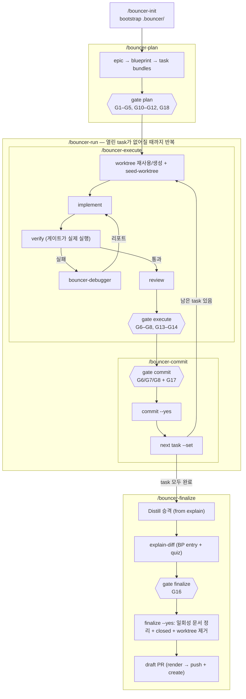

# 워크플로

사람이 읽는 개요입니다. 각 단계의 정본은 해당 `skills/<name>/SKILL.md`이고,
에이전트가 지키는 규칙은 플러그인 루트 `CLAUDE.md`와 `rules/`에 있습니다.

## 다섯 단계

| 단계 | 하는 일 | 막는 게이트 |
| --- | --- | --- |
| `/bouncer-init` | 프로젝트당 한 번 `.bouncer/` 부트스트랩 | — |
| `/bouncer-plan` | epic → blueprint → task 묶음 작성, 경로 추천 주입, `affected_paths` 확정, 계획 문서 리뷰, 승인, 활성 포인터 기록 | plan (G1–G5, G10–G12, G18 — `scale: light`면 G18 없음) |
| `/bouncer-execute` | worktree 재사용·생성 → 계획 문서 seed → 구현 → verify → review. **커밋하지 않음** | execute (G6–G8, G13–G14) |
| `/bouncer-commit` | 스코프 dry-run → task 하나 커밋 → 다음 task로 포인터 이동 | commit (G6/G7/G8 + G17) |
| `/bouncer-finalize` | Distill 승격 → explain + 퀴즈 → 남은 변경 커밋 → worktree 제거 → draft PR | finalize (G16) |

계획을 마치면 **`/bouncer-run`으로 이어집니다.** execute→commit을 task가 소진될
때까지 반복하는 기본 주행 경로이고, 얼마나 자주 물어볼지는
`config.autonomy`(`auto` | `interactive`)가 정합니다. `/bouncer-execute`와
`/bouncer-commit`을 직접 부르는 것은 task 하나만 처리하거나 멈춘 주행을 복구할
때입니다. 단계 순서 자체는 위 표 그대로입니다.

## 단계별 스킬

| 단계 | 스킬 |
| --- | --- |
| `/bouncer-plan` | `discovery` → `spec-authoring` → `stop-slop` → `graphify-runner` → `minimality` → `context-review` |
| `/bouncer-execute` | `implementation` → `verification` → `review` → `minimality` (verify 실패 시 `debugging` → implementer 재호출) |
| `/bouncer-commit` | 게이트와 확인만 — explain 단계 없음 |
| `/bouncer-finalize` | `spec-authoring`(explain→Distill 승격) → `explain-diff` |

execute의 구현·리뷰·디버그는 named 서브에이전트 `bouncer-implementer` /
`bouncer-reviewer` / `bouncer-debugger`로 분리됩니다. 계획 승인 직전의 문서
판정은 `bouncer-context-reviewer`입니다.

## 알아둘 것

- **worktree는 blueprint당 하나입니다.** `/bouncer-execute`가
  `.worktrees/<epic-id>/<bp-id>`에 만들고 그 blueprint의 모든 task가 공유합니다.
  제거는 `/bouncer-finalize`만 합니다.
- **execute는 커밋하지 않습니다.** 커밋은 `/bouncer-commit`의 몫입니다.
- **주행이 멈추는 경우는 셋입니다** — verify 재실패, 리뷰 왕복 상한, 범위 위반.
  포인터와 worktree를 그대로 두므로 `/bouncer-execute`로 그 task만 닫은 뒤
  `/bouncer-run`을 다시 걸면 됩니다.
- **리뷰 재검 왕복 상한 2회**는 `/bouncer-run` 주행뿐 아니라 `/bouncer-execute`를
  단독으로 부를 때도 같은 숫자로 걸립니다. 상한에 닿으면 `/bouncer-plan`으로
  갑니다.
- **좁은 범위 작업**은 `/bouncer-plan`이 경량 여부를 묻고 blueprint
  `bouncer.scale`을 `light`로 바꿉니다. 무엇이 줄고 무엇이 그대로인지는
  [`rules/governance.md`](../rules/governance.md) `## Lightweight cycle`에
  있습니다.
- **경량 계획은 문서 넷·100줄입니다.** 선언을 받으면 plan이
  `bouncer scaffold blueprint --scale light`로 blueprint `index.md`와
  `tasks/001/{tasks,verification,review}.md`만 만듭니다. `context-review.md`가
  없으니 계획 문서 판정 단계도, plan 게이트의 G18도 없습니다. task 본문은
  Goal & intent·Touch·Checklist 셋만 쓰면 G10을 통과하고, `affected_paths`
  확정과 G4·G5·G11·G12는 일반 경로와 똑같이 받습니다.
- **full로 돌아가려면** blueprint `index.md`의 `bouncer.scale`을 `full`로
  되돌리고, `bouncer scaffold context-review --blueprint <dir>`로 판정 문서를
  만든 뒤 task에 Interface·Do not touch 절을 채웁니다. 그 다음 plan 게이트를
  다시 돌리면 G18과 다섯 절이 함께 요구됩니다.
- **마감한 blueprint는 잠깁니다.** `finalize --yes`가 G16 뒤 같은 remainder
  커밋에서 `tasks/<NNN>/tasks.md`, `tasks/<NNN>/verification.md`,
  `tasks/<NNN>/review.md`, 있을 때의 `context-review.md`를 지우고
  `bouncer.status`를 `closed`로 바꿉니다. `explain.md`는 남깁니다. `closed`는
  종단이라 다시 열거나 task를 붙이지 않습니다. 후속 작업은 같은 Epic의 sibling
  Blueprint이거나 `/bouncer-plan`으로 새 Epic을 계획합니다. 보존·후속 기준의
  정본은
  [context-retention-and-epic-lifecycle.md](context-retention-and-epic-lifecycle.md)입니다.

## 더 보기

게이트 표와 실패 코드는 [gates.md](gates.md), CLI는 [cli.md](cli.md), 설정은
[configuration.md](configuration.md), 커밋 가드의 한계는
[security.md](security.md), 완료 문서 보존과 Epic·sibling 기준은
[context-retention-and-epic-lifecycle.md](context-retention-and-epic-lifecycle.md)에
있습니다. 주행 상한과 중단 규칙의 정본은 `skills/bouncer-run/SKILL.md`입니다.
