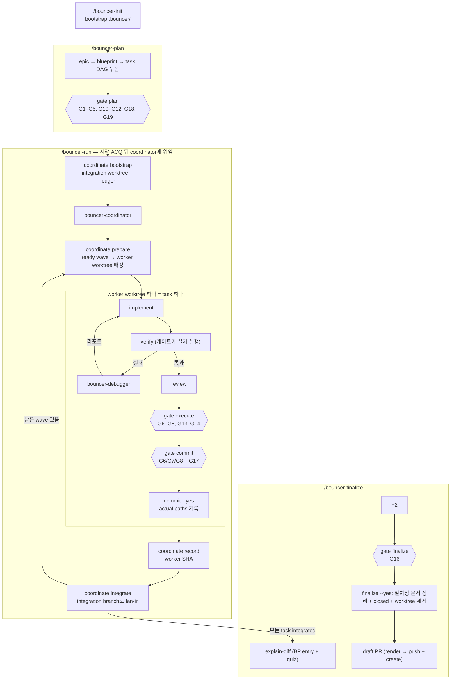

# 워크플로

사람이 읽는 개요입니다. 각 단계의 정본은 해당 `skills/<name>/SKILL.md`이고,
에이전트가 지키는 규칙은 플러그인 루트 `CLAUDE.md`와 `rules/`에 있습니다.

## 다섯 단계

| 단계 | 하는 일 | 막는 게이트 |
| --- | --- | --- |
| `/bouncer-init` | 프로젝트당 한 번 `.bouncer/` 부트스트랩 | — |
| `/bouncer-plan` | epic → blueprint → task 묶음 작성(선택적 DAG 필드 포함), 경로 추천 주입, `affected_paths` 확정, 계획 문서 리뷰, 승인, 활성 포인터 기록 | plan (G1–G5, G10–G12, G18, G19 — `scale: light`면 G18 없음) |
| `/bouncer-execute` | worktree 재사용·생성 → 계획 문서 seed → 구현 → verify → review. **커밋하지 않음** | execute (G6–G8, G13–G14) |
| `/bouncer-commit` | 스코프 dry-run → task 하나 커밋 → 위임 주행이면 결과를 coordinator에 보고, 직접 실행이면 다음 task로 포인터 이동 | commit (G6/G7/G8 + G17) |
| `/bouncer-finalize` | explain + 퀴즈 → 남은 변경 커밋 → worktree 제거 → draft PR | finalize (G16) |

계획을 마치면 **`/bouncer-run`으로 이어집니다.** run은 시작 ACQ 하나만 받고
남은 task 전체를 **coordinator**(`bouncer-coordinator`) 하나에 위임합니다.
run 세션 자체는 코드를 고치지 않고 coordinator가 돌려주는 보고만 렌더링합니다.

| 자리 | 무엇을 하나 |
| --- | --- |
| main worktree | 읽기 전용 provenance — base SHA·계획 문서·context-search 결과만 읽습니다. 주행 중 source를 쓰지 않습니다. main checkout 아래에 무언가를 만드는 명령은 `bouncer coordinate bootstrap`과 `prepare` 둘뿐입니다. `bootstrap`은 main worktree에서 불러 integration worktree를, `prepare`는 integration worktree에서 불러 wave의 worker worktree를 등록합니다 — 부르는 자리는 다르지만 둘 다 `.worktrees/…` 디렉터리 생성과 worktree 등록까지이고, tracked source는 어느 쪽도 건드리지 않습니다 |
| **integration worktree** | coordinator의 작업 자리. 원장(ledger)과 fan-in 대상 branch가 있습니다 |
| **worker worktree** | **ready wave**가 연 task마다 하나. 구현·검증·리뷰·task 커밋이 여기서 일어납니다 |

coordinator는 원장을 읽어 ready wave를 열고(`prepare`), wave의 task마다
worker worktree에서 `/bouncer-execute` → `/bouncer-commit`을 돌립니다. 그 task
커밋이 **actual paths**를 원장에 남기고, coordinator는 결과 SHA를 원장에
기록한 뒤(`record`) integration branch로 fan-in합니다(`integrate`). `config.autonomy`(`auto` | `interactive`)는 승인
빈도가 아니라 **보고 주기**만 정합니다 — `interactive`는 task 경계마다 진행
한 줄, `auto`는 마감 보고에 모아서. 두 값 모두 task별 ACQ를 열지 않습니다.
`/bouncer-execute`와 `/bouncer-commit`을 직접 부르는 것은 task 하나만
처리하거나 멈춘 주행을 복구할 때입니다. 단계 순서 자체는 위 표 그대로입니다.

**DAG가 없는 기존 계획도 그대로 돕니다.** task frontmatter의
`depends_on`·`parallel_safe`·`dependency_gate`가 없으면 각각 의존 없음·순차·
`integrated`로 읽히므로, coordinator는 한 번에 한 node짜리 wave로 예전과 같은
순서를 냅니다. 병렬은 계획이 `parallel_safe: true`를 명시한 task 사이에서만
열립니다.

## 단계별 스킬

| 단계 | 스킬 |
| --- | --- |
| `/bouncer-plan` | `discovery` → `spec-authoring` → `stop-slop` → `graphify-runner` → `minimality` → `context-review` |
| `/bouncer-execute` | `implementation` → `verification` → `review` → `minimality` (verify 실패 시 `debugging` → implementer 재호출) |
| `/bouncer-commit` | 게이트와 확인만 — explain 단계 없음 |
| `/bouncer-finalize` | `explain-diff` |

execute의 구현·리뷰·디버그는 named 서브에이전트 `bouncer-implementer` /
`bouncer-reviewer` / `bouncer-debugger`로 분리됩니다. 계획 승인 직전의 문서
판정은 `bouncer-context-reviewer`이고, 위임 주행의 컨트롤러는
`bouncer-coordinator`입니다. coordinator는 이 세 worker를 부르되 그 역할을
스스로 대신하지 않고, 한 주행에 coordinator는 하나뿐입니다(중첩 없음).

## 알아둘 것

- **worktree는 역할마다 나뉩니다.** coordinator 주행은 blueprint 하나에
  integration worktree `.worktrees/<epic-id>/<bp-id>/integration` 하나와, ready
  wave가 연 task마다 worker worktree
  `.worktrees/<epic-id>/<bp-id>/workers/<NNN>` 하나를 씁니다. 생성은
  `bouncer coordinate bootstrap`·`prepare`만, 제거는 `/bouncer-finalize`만
  합니다. coordinator 없이 `/bouncer-execute`를 직접 부르면 예전처럼 blueprint
  하나짜리 `.worktrees/<epic-id>/<bp-id>`를 만들어 그 blueprint의 task가
  공유합니다.
- **main worktree는 읽기 전용 provenance입니다.** 주행 중 coordinator와 worker는
  자기에게 배정된 worktree에만 씁니다. main checkout에서 낸 커밋은 `bouncer
  commit`과 `commit-safety` 훅이 `main-worktree-source-write`로 거절합니다.
- **execute는 커밋하지 않습니다.** 커밋은 `/bouncer-commit`의 몫이고, 주행
  중에는 배정된 worker worktree 안에서 일어납니다.
- **포인터는 저장소에 하나입니다.** Git common directory에 있어 모든 linked
  worktree가 같은 값을 읽습니다. 주행 중에는 coordinator만 `bouncer current
  --set`을 부르며, ready wave가 여러 task를 열어도 구현은 한 번에 하나씩
  진행하고 그 순서를 원장에 남깁니다. worker는 포인터를 옮기지 않습니다.
- **주행 중 판정은 coordinator가 합니다.** verify 재실패, 리뷰 왕복 상한, 범위
  위반은 그 자리에서 주행을 끝내지 않습니다. coordinator가 accepted / scope
  revision(`bouncer coordinate revise`) / 원인을 지목한 rework / task·graph
  변경 / terminal blocked 중 하나로 판정하고 원장에 남깁니다. 주행 중에
  `/bouncer-plan`으로 후퇴하지 않습니다. `blocked`로 끝나면 원장·worktree·
  포인터를 그대로 두므로, 원인을 고친 뒤 `/bouncer-run`을 다시 걸어 그 지점부터
  재개합니다.
- **리뷰는 기본 두 번, 조건부 세 번째 round 한 번입니다.** 세 번째는 기존
  blocker·major가 해결되고 verify가 통과했으며 신규 actionable finding이
  Goal, Interface, Constraints, `affected_paths` 안에 있을 때만 허용합니다.
  세 번째 뒤 잔존·재발·새 설계가 필요하면 네 번째 round는 없습니다.
  `/bouncer-execute`를 직접 돌리는 중이면 `/bouncer-plan`으로 가고, 위임 주행
  중이면 coordinator가 rework·scope revision·terminal blocked 중 하나로
  판정합니다. `/bouncer-run`은 이 상한을 복제하지 않고 `/bouncer-execute`를
  따릅니다.
- **좁은 범위 작업**은 `/bouncer-plan`이 경량 여부를 묻고 blueprint
  `bouncer.scale`을 `light`로 바꿉니다. 무엇이 줄고 무엇이 그대로인지는
  [`rules/governance.md`](../rules/governance.md) `## Lightweight cycle`에
  있습니다.
- **경량 계획은 문서 넷·100줄입니다.** 선언을 받으면 plan이
  `bouncer scaffold blueprint --scale light`로 blueprint `index.md`와
  `tasks/001/{tasks,verification,review}.md`만 만듭니다. `context-review.md`가
  없으니 계획 문서 판정 단계도, plan 게이트의 G18도 없습니다. task 본문은
  Goal & intent·Touch·Checklist 셋만 쓰면 G10을 통과하고, `affected_paths`
  확정과 G4·G5·G11·G12는 일반 경로와 똑같이 받습니다.
- **full로 돌아가려면** blueprint `index.md`의 `bouncer.scale`을 `full`로
  되돌리고, `bouncer scaffold context-review --blueprint <dir>`로 판정 문서를
  만든 뒤 task에 Interface·Do not touch 절을 채웁니다. 그 다음 plan 게이트를
  다시 돌리면 G18과 다섯 절이 함께 요구됩니다.
- **마감한 blueprint는 잠깁니다.** `finalize --yes`가 G16 뒤 같은 remainder
  커밋에서 `tasks/<NNN>/tasks.md`, `tasks/<NNN>/verification.md`,
  `tasks/<NNN>/review.md`, 있을 때의 `context-review.md`를 지우고
  `bouncer.status`를 `closed`로 바꿉니다. `explain.md`는 남깁니다. `closed`는
  종단이라 다시 열거나 task를 붙이지 않습니다. 후속 작업은 같은 Epic의 sibling
  Blueprint이거나 `/bouncer-plan`으로 새 Epic을 계획합니다. 보존·후속 기준의
  정본은
  [context-retention-and-epic-lifecycle.md](context-retention-and-epic-lifecycle.md)입니다.

## 더 보기

게이트 표와 실패 코드는 [gates.md](gates.md), `bouncer coordinate`의 서브커맨드와
거절 코드를 포함한 CLI는 [cli.md](cli.md), 중단한 주행의 복구 절차는
[troubleshooting.md](troubleshooting.md), 설정은
[configuration.md](configuration.md), 완료 문서 보존과 Epic·sibling 기준은
[context-retention-and-epic-lifecycle.md](context-retention-and-epic-lifecycle.md)에
있습니다. PreToolUse 커밋 가드는 실수 방지용이며 악의적 우회를 막지 않습니다.
주행 상한과 중단 규칙의 정본은 `skills/bouncer-run/SKILL.md`입니다.
